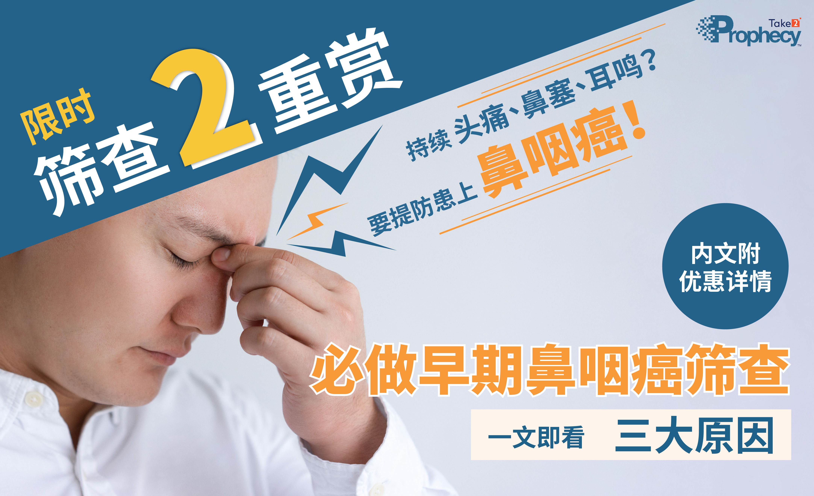
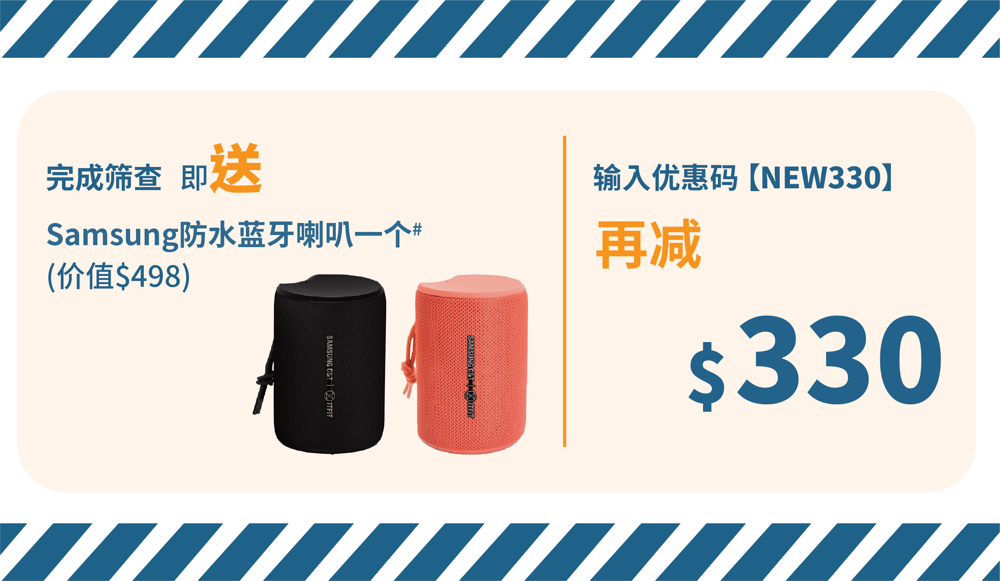
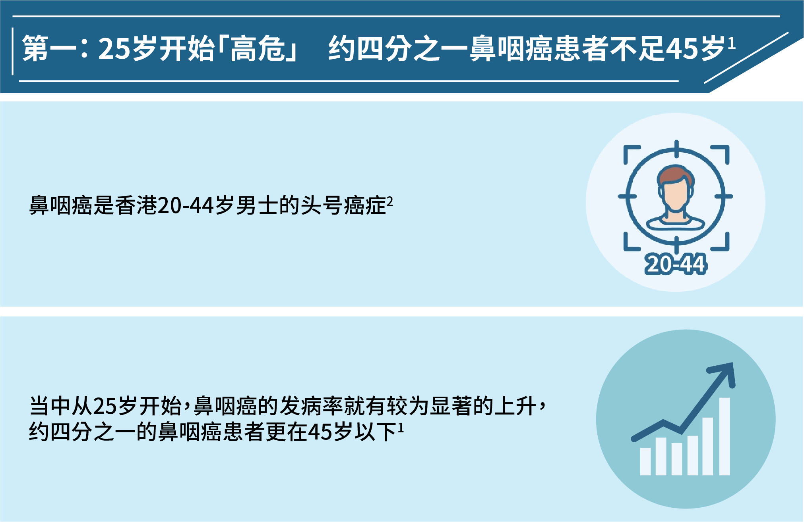
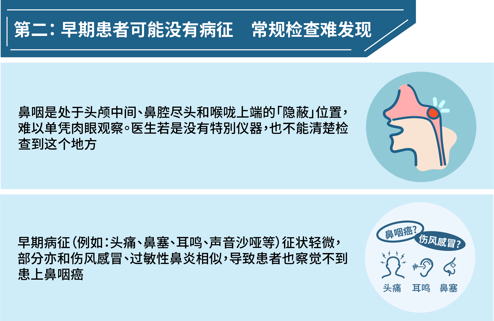
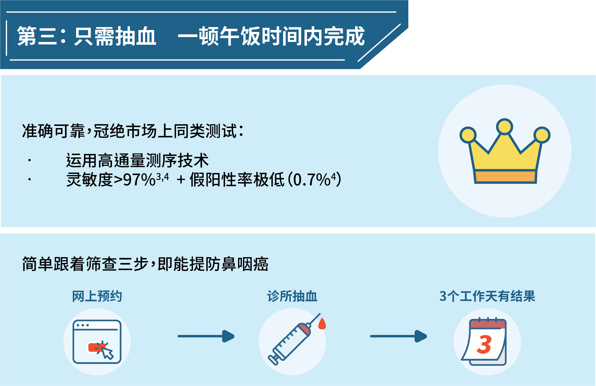

---
languages:
- zh-CN
cover:
- "../images/simplified-600x300.jpg"
date: 2022-08-01T00:00:00.000+08:00
title: "【筛查2重赏】限时钜惠活动　预约早期鼻咽癌筛查为健康添保障"
detail: 新一期的消费券将于8月7日开始陆续发放，想成为「精明」的消费者，当然是要把握优惠，投资于自己的健康！
type: ''
pdf: ''
href: ''
slug: take2-rewards
hide: true

---

### **立即预约：**[https://bit.ly/37XYNpY](https://bit.ly/37XYNpY "https://bit.ly/37XYNpY")

 

### 新一期的消费券将于8月7日开始陆续发放，想成为「精明」的消费者，当然是要把握优惠，投资于自己的健康！

 

## **限时２重赏　可享优惠合共超过$800**

**优惠一**：由即日起至2022年8月31日，在得易健康服务平台购买Take2 Prophecy™ 早期鼻咽癌筛查（单项测试），并于2022年9月5日或以前完成抽血程序，立即送您Samsung C&T ITFIT IPX7 防水蓝牙喇叭乙一个（价值港币$498）。

\#礼品数量有限，送完即止。

 

**优惠二**：在预约时，输入优惠码「NEW330」，更可享额外折扣$330 （原价：$2,200）。

名额有限，把握机会，尽享优惠合共超过$800！

### **立即预约：**[https://bit.ly/37XYNpY](https://bit.ly/37XYNpY "https://bit.ly/37XYNpY")

 

## 为什么你要进行早期鼻咽癌筛查？以下三大原因，让你了解投资在健康上绝对是「物超所值」！

 

 

 

愈早发现，治愈的可能性亦愈高，早期患者的存活率可高达百分之九十以上²。

### **立即預約：**[https://bit.ly/37XYNpY](https://bit.ly/37XYNpY "https://bit.ly/37XYNpY")

 

优惠受条款及细则约束。礼品款式或颜色将随机送出，数量有限，先到先得，送完即止。

得易健康服务平台可提供三天后的预约，唯所有预约需视乎诊所的实际情况而定。

1 _Hong Kong Cancer Registry_. Hong Kong Hospital Authority, www3.ha.org.hk/cancereg/. Accessed 23 May 2021.

2 _Overview of Hong Kong Cancer Statistics of 2019_. Hong Kong Cancer Registry. Hong Kong Hospital Authority, October 2021

3 Chan, K. C. Allen, et al. “Analysis of Plasma Epstein–Barr Virus DNA to Screen for Nasopharyngeal Cancer.” _New England Journal of Medicine_, vol. 377, no. 6, 2017, pp. 513–22.

4 Lam, W. K. Jacky, et al. “Sequencing-Based Counting and Size Profiling of Plasma Epstein–Barr Virus DNA Enhance Population Screening of Nasopharyngeal Carcinoma.” _Proceedings of the National_ _Academy of Sciences_, vol. 115, no. 22, 2018, pp. E5115–24.

 

「筛查2重赏」推广优惠（「推广优惠」）条款及细则

1\. 以下条款（「本条款」）适用于由得易健康有限公司（「我们」或「我们的」）所提供的推广优惠。参加此推广优惠，即表示您同意本条款。

2\. 您必须一并阅读本条款、我们网站 take2health.net 的[私隐政策](https://take2health.net/zh-CN/terms-and-conditions/privacy-policy/)、[网站使用条款](https://take2health.net/zh-CN/terms-and-conditions/website-terms-of-use/)、[个人资料收集声明](https://take2health.net/zh-CN/terms-and-conditions/personal-information-collection-statement)、[得易健康服务平台 《私隐政策》](https://take2health.net/health-platform/agreement/2)、[得易健康服务平台条款](https://take2health.net/health-platform/agreement/3)、[得易健康服务平台《个人资料收集声明》](https://take2health.net/health-platform/agreement/1)，以及我们可能向您提供的任何其他条款（「其他条款」）。除本条款外，任何其他条款亦一并适用。

3\. 「筛查2重赏」相关推广资讯中任何使用的「2重赏」字眼，其意思为包括「NEW330」优惠码推广优惠及此推广优惠，而两者是可独立使用的优惠。此推广优惠则只指下述第4条所列的优惠。（如要享用「NEW330」优惠码推广优惠，则要符合其推广优惠条款及细则上所列之要求，请参阅：[“NEW330”优惠码推广（「推广优惠」）条款及细则](https://take2health.net/zh-CN/whats-new/promotions/new330-tnc)）

4\. 要参加此推广优惠，您必须符合下列要求，方可获赠礼品（「礼品」）──Samsung C&T ITFIT IPX7 防水蓝牙喇叭一个（价值：港币498）：

a. 于优惠推广期2022年8月1日起至2022年8月31日，包括首尾两天（「推广期」）内，透过得易健康服务平台[https://take2health.net/health-platform/](https://take2health.net/health-platform/ "https://take2health.net/health-platform/") 独立购买Take2 Prophecy™ 早期鼻咽癌筛查（单项测试） ；

b. 成为Take2 Extra Care会员；

c. 和于2022年9月5日或之前成功完成付款及到预约之服务点完成抽血程序，方为「合资格预约」。有关成功完成付款的定义，请参阅本条款及细则第 7 条。

5\. 礼品款式或颜色将随机送出，礼品供应须视乎其供应量而定，数量有限，先到先得，送完即止。若礼品已赠罄，我们保留以其他礼品 / 礼券 / 奖赏代替而不作另行通知的权利，而有关礼品 / 礼券 / 奖赏的价值及性质可能有别于原有礼品。

6\. 合资格预约的日期及时间，均以香港时间 (GMT+08:00) 计算，并以我们的伺服器所获得之数据为准。任何因电脑、网路等技术问题而引致用户所递交的资料有延迟、遗失、错误、无法辨识等情况，我们概不负责。

7\. 成功完成付款是根据我们所持有的金融机构交易纪录及按其绝对酌情权作出最终决定（如有任何差异，以我们持有的金融机构交易纪录为准）。

8\. 如取消任何成功交易或进行退款，即不可获享此推广优惠中的任何礼品。

9\. 礼品概不包括货品保养、转让、退换，也不能兑换现金或以任何形式作补偿。

10\. 得易健康有限公司并非此推广优惠之礼品或服务之供应商，对此礼品或服务并无作出任何声明或担保；因此有关礼品或服务的各方面（包括但不限于质素及供应量），我们毋须负上任何责任。如对有关礼品或服务有任何争议或投诉，您应直接联络有关供应商。

11\. 有关礼品的照片只供参考，可能与实物略有差异，一切以实物作准。任何就两者之不同而作出的投诉将不获受理。

12\. 若阁下未能于指定礼品换领期内，携同有效之证明文件到指定礼品换领地点领取相关礼品，即等同自行放弃领取相关礼品之权利。有关之礼品换领信及详情将不迟于2022年9月9日发送至阁下登记的电邮信箱，有关换领指引请参阅届时的通知电邮。

13\. 此推广优惠仅适用于得易健康有限公司指定服务及产品，而不适用于第三方的医疗服务及／或检测服务供应商所提供及销售的服务及产品。

14\. 我们保留全权酌情决定，恕不另行通知或提供理由。我们可随时：

a. 修订、更改、暂停或终止此推广优惠或本条款（包括任何优惠或折扣金额)；

b. 作出与此推广优惠相关的任何决定（包括拒绝或停止您参与此推广优惠，决定此推广优惠是否可以与其他任何优惠或推广优惠结合使用）；和

c. 决定已被批核的优惠是否存在不正当目的，并取消您享有推广优惠的权利。

任何此类决定均应视为最终决定并对您具有约束力。

15\. 如就此推广优惠有任何争议，我们保留最终决定权。

16\. 本条款及细则在所有方面均受香港特别行政区法律的管限，并须根据香港特别行政区法律的解释。双方得受香港特别行政区法院的专属管辖权管辖。

17\. 如本条款的不同语言版本有任何抵触或不相符之处，应以英文版本为准。

最后更新日期：2022年8月1日