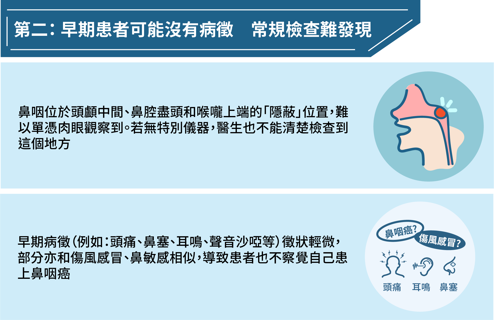

---
languages:
- zh-HK
cover:
- "../images/traditional-600x300.jpg"
date: 2022-08-01T00:00:00.000+08:00
title: "【篩查2重賞】限時激減優惠　預約早期鼻咽癌篩查為健康添保障"
detail: 新一期的消費券將於8月7日開始陸續發放，想花費得更「精明」，當然是把握優惠，投資在自己的健康！
type: ''
pdf: ''
href: ''
slug: take2-rewards
hide: true

---

### **立即預約：**[https://bit.ly/37XYNpY](https://bit.ly/37XYNpY "https://bit.ly/37XYNpY")

 

### 新一期的消費券將於8月7日開始陸續發放，想花費得更「精明」，當然是把握優惠，投資在自己的健康！

 

## **限時２重賞　可享優惠**總**值超過$800**

**優惠一**：由即日起至2022年8月31日，於得易健康服務平台購買Take2 Prophecy™ 早期鼻咽癌篩查（單項測試），並在2022年9月5日或之前完成抽血程序，即送Samsung C&T ITFIT IPX7 防水藍牙喇叭乙個（價值港幣$498）。

\#禮品數量有限，送完即止。

 

**優惠二**：在預約時，輸入優惠碼「NEW330」，更可享額外折扣$330 （原價：$2,200）。

名額有限，把握機會，盡享優惠總值超過$800！

### 立即預約：[https://bit.ly/37XYNpY](https://bit.ly/37XYNpY "https://bit.ly/37XYNpY")

 

## 為什麼你要進行早期鼻咽癌篩查？以下三大原因，讓你了解投資在健康上絕對是「物超所值」！

 

 

 

愈早發現，治癒的可能性亦愈高，早期患者的存活率可高於九成²。

### **立即預約：**[https://bit.ly/37XYNpY](https://bit.ly/37XYNpY "https://bit.ly/37XYNpY")

 

優惠受條款及細則約束。禮品款式或顏色將隨機送出，數量有限，先到先得，送完即止。

得易健康服務平台可提供三天後的預約，唯所有預約需視乎診所的實際情況而定。

1 _Hong Kong Cancer Registry_. Hong Kong Hospital Authority, www3.ha.org.hk/cancereg/. Accessed 23 May 2021.

2 _Overview of Hong Kong Cancer Statistics of 2019_. Hong Kong Cancer Registry. Hong Kong Hospital Authority, October 2021

3 Chan, K. C. Allen, et al. “Analysis of Plasma Epstein–Barr Virus DNA to Screen for Nasopharyngeal Cancer.” _New England Journal of Medicine_, vol. 377, no. 6, 2017, pp. 513–22.

4 Lam, W. K. Jacky, et al. “Sequencing-Based Counting and Size Profiling of Plasma Epstein–Barr Virus DNA Enhance Population Screening of Nasopharyngeal Carcinoma.” _Proceedings of the National_ _Academy of Sciences_, vol. 115, no. 22, 2018, pp. E5115–24.

 

「篩查2重賞」推廣優惠（「推廣優惠」）條款及細則

1\.	以下條款（「本條款」）適用於由得易健康有限公司（「我們」或「我們的」）所提供的推廣優惠。參加此推廣優惠，即表示你同意本條款。

2\. 你必須一併閱讀本條款、我們網站 take2health.net 的[私隱政策](https://take2health.net/terms-and-conditions/privacy-policy/)、[網站使用條款](https://take2health.net/terms-and-conditions/website-terms-of-use/)、[個人資料收集聲明](https://take2health.net/terms-and-conditions/personal-information-collection-statement/)、[得易健康服務平台 《私隱政策》](https://take2health.net/health-platform/agreement/2)、[得易健康服務平台條款](https://take2health.net/health-platform/agreement/3)、[得易健康服務平台《個人資料收集聲明》](https://take2health.net/health-platform/agreement/1)，以及我們可能向你提供的任何其他條款（「其他條款」）。除本條款外，任何其他條款亦一併適用。

3\.	在「篩查2重賞」相關推廣資訊中任何使用的「2重賞」字眼，其意思為包括「NEW330」優惠碼推廣優惠及此推廣優惠，而兩者是可獨立使用的優惠。此推廣優惠 則只指下述第4條所列的優惠。（如要享用「NEW330」優惠碼推廣優惠，則要符合其推廣優惠條款及細則上所列之要求，請參閱：[「NEW330」優惠碼推廣（「推廣優惠」）條款及細則](https://take2health.net/whats-new/promotions/new330-tnc)）

4\.	要參加此推廣優惠，你必須符合下列要求，方可獲贈禮品（「禮品」）──Samsung C&T ITFIT IPX7 防水藍牙喇叭乙個（價值：港幣498）：

a.	於優惠推廣期2022年8月1日起至2022年8月31日，包括首尾兩天（「推廣期」）內，透過得易健康服務平台[https://take2health.net/health-platform/](https://take2health.net/health-platform/ "https://take2health.net/health-platform/")  獨立購買Take2 Prophecy™ 早期鼻咽癌篩查（單項測試） ；

b.	成為Take2 Extra Care會員；

c.	和於2022年9月5日或之前成功完成付款及到預約之服務點完成抽血程序，方為「合資格預約」。有關成功完成付款的定義，請參閱本條款及細則第 7 條。

5\.	禮品款式或顏色將隨機送出，禮品供應須視乎其供應量而定，數量有限，先到先得，送完即止。若禮品已贈罄，我們保留以其他禮品 / 禮券 / 獎賞代替而不作另行通知的權利，而有關禮品 / 禮券 / 獎賞的價值及性質可能有別於原有禮品。

6\.	合資格預約的日期及時間，均以香港時間 (GMT+08:00) 計算，並以我們的伺服器所獲得之數據為準。任何因電腦、網路等技術問題而引致用戶所遞交的資料有延遲、遺失、錯誤、無法辨識等情況，我們概不負責。

7\.	成功完成付款是根據我們所持有的金融機構交易紀錄及按其絕對酌情權作出最終決定（如有任何差異，以我們持有的金融機構交易紀錄為準）。

8\.	如取消任何成功交易或進行退款，即不可獲享此推廣優惠中的任何禮品。

9\.	禮品概不包括貨品保養、轉讓、退換，也不能兌換現金或以任何形式作補償。

10\.	得易健康有限公司並非此推廣優惠之禮品或服務之供應商，對此禮品或服務並無作出任何聲明或擔保；因此有關禮品或服務的各方面（包括但不限於質素及供應量），我們毋須負上任何責任。如對有關禮品或服務有任何爭議或投訴，你應直接聯絡有關供應商。

11\.	有關禮品的照片只供參考，可能與實物略有差異，一切以實物作準。任何就兩者之不同而作出的投訴將不獲受理。

12\.	若閣下未能於指定禮品換領期內，攜同有效之證明文件到指定禮品換領地點領取相關禮品，即等同自行放棄領取相關禮品之權利。有關之禮品換領信及詳情將不遲於2022年9月9日發送至閣下登記的電郵信箱，有關換領指引請參閱屆時的通知電郵。

13\.	此推廣優惠僅適用於得易健康有限公司指定服務及產品，而不適用於第三方的醫療服務及／或檢測服務供應商所提供及銷售的服務及產品。

14\.	我們保留全權酌情決定，恕不另行通知或提供理由。我們可隨時：

a.	修訂、更改、暫停或終止此推廣優惠或本條款（包括任何優惠或折扣金額)；

b.	作出與此推廣優惠相關的任何決定（包括拒絕或停止你參與此推廣優惠，決定此推廣優惠是否可以與其他任何優惠或推廣優惠結合使用）；和

c.	決定已被批核的優惠是否存在不正當目的，並取消你享有推廣優惠的權利。

任何此類決定均應視為最終決定並對你具有約束力。

15\.	如就此推廣優惠有任何爭議，我們保留最終決定權。

16\.	本條款及細則在所有方面均受香港特別行政區法律的管限，並須根據香港特別行政區法律的解釋。雙方得受香港特別行政區法院的專屬管轄權管轄。

17\.	如本條款的不同語言版本有任何抵觸或不相符之處，應以英文版本為準。

最後更新日期：2022年8月1日