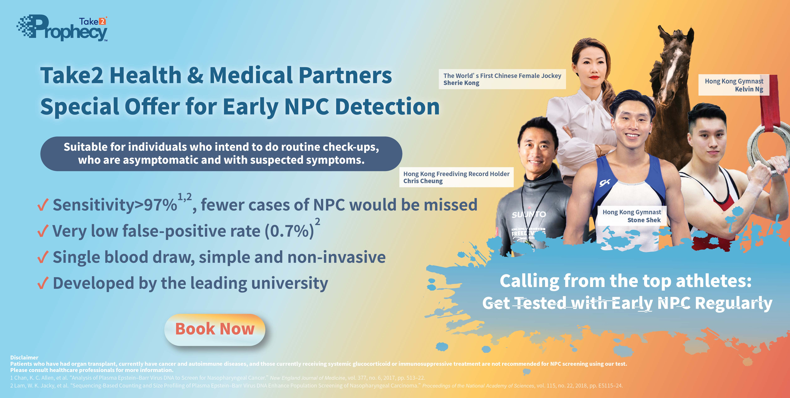
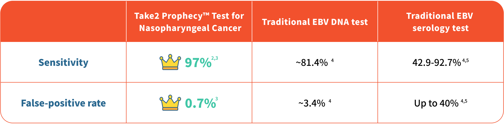

---
languages:
- en
cover:
- "../images/thumbnail_eng-300-x-600.jpg"
date: 2022-05-06T00:00:00.000+08:00
title: Take2 Health & Medical Partners｜Special Offer for Early Nasopharyngeal Cancer
  Detection
detail: Take2 Health & Medical Partners｜Special Offer for Early Nasopharyngeal Cancer
  Detection
type: ''
pdf: ''
href: ''
slug: athletes-medical-collaborations
hide: true

---

As the Chinese idiom goes, “One minute on the stage needs ten years practice off stage”. To achieve the best results in the competition, athletes prepare thoroughly in advance. However, there would always be unexpected issues which can interrupt their game plans no matter how fit they are. Similarly, imagine if you are diagnosed with cancer in the prime time of your life, how would your life be disrupted?

Nasopharyngeal cancer (NPC) is one of the most common head and neck cancers in Hong Kong, with the peak incidence occurring among those aged 40–50, and it is the top cancer for men aged between 20-44¹. As the symptoms of early NPC resemble flu or inflammatory illnesses, including headache, nasal blockage, and tinnitus, it is typically easy to let the patients’ guards down, causing a delay in seeking medical consultation. As such, the best timing for NPC treatment is often missed when they notice the situation is getting worse. Stop guessing and get tested with early NPC regularly. The Take2 Prophecy™ Test for NPC only requires a simple blood draw at the clinic which is nearby your home or work locations, you can get it done within a lunchtime!

 

**Sensitivity ranks the top over other similar tests**

The Take2 Prophecy™ Test for Nasopharyngeal Cancer (NPC), using Next-generation Sequencing (NGS) technology, analyses human and NPC-associated genomic signatures of EBV DNA in the blood plasma. It enables patients with non-specific symptoms to be identified at the early stage for timely treatment. Also, the Take2 Prophecy™ Test for NPC has over 97% sensitivity² ³, which ranks the top over other similar tests!

**Do not hesitate, Book now!**

**Take2 Health collaborates with medical partners, offering a special discount on Take2 Prophecy™ Test for NPC, including:**

**1.** **Human Health** **- Early Nasopharyngeal Cancer Screening ($1,445) (promo code: SUPERDAD)**

**Locations:** Mong Kok

**E-booking:** [https://bit.ly/3sWDNas](https://bit.ly/3sWDNas "https://bit.ly/3sWDNas")

**Details:** The plan includes Collection of blood samples and Test Results interpretation by doctor.

 

**2. JP Partners Medical - Early Detection Test for NPC ($1,500)**

**Locations:** North Point / Central / Diamond Hill / Kowloon City / Jordan / Mong Kok / Tsuen Wan / Sheung Shui / Tuen Mun

**E-booking:** [https: //bit.ly/3OHwU69](https://bit.ly/3OHwU69) / **WhatsApp enquiry:** 9011 8042

**Details:** The plan includes Doctor Consultation and Report Explanation by Doctor. Test results are ready within 7 – 10 working days.

 

**3. Kinetics Medical & Health Group Co - Carcinoma (NPC) DNA Screening ($1,500)**

**Locations:** Causeway Bay / Jordan / Tsuen Wan / Sha Tin

**E-booking:** [https://bit.ly/3NW18S1](https://bit.ly/3NW18S1 "https://bit.ly/3NW18S1") **/ WhatsApp enquiry & booking:** 9336 8186

**Details:** Report will be issued within 4 weeks after checkup and submission of all required specimens.

 

**4. Medicare Group - Early Detection Test for NPC ($1,800)**

**Locations:** Tsim Sha Tsui

**E-booking:** [https: //bit.ly/36PicJ8](https://bit.ly/36PicJ8)

**Details:** Test results are ready within 7 days. The plan includes Report Explanation by Doctor.

 

**5. Medtimes Medical Group – Smoker Health Check Plan (Standard) ($2,980)**

**Locations:** Tsim Sha Tsui / Sheung Shui

**E-booking:** [https://bit.ly/3yYG6Ob](https://bit.ly/3yYG6Ob "https://bit.ly/3yYG6Ob") / **Tel for booking:** 3585 8533

**Details:** The plan includes Prophecy Early Nasopharyngeal Cancer Screening, Physical Examination, Heart Examination, X-Ray Examination, Blood Lipid, Complete Blood Count (CBC), Diabetes and Report Explanation by Medical Professionals.

 

**Medtimes Medical Group – Take2 Prophecy Test ($3,000)**

**Locations:** Tsim Sha Tsui / Sheung Shui

**E-booking:** [https: //bit.ly/3KksG0I](https://bit.ly/3KksG0I) / **Tel for booking:** 3585 8533

**Details:** Theplan includes Take2 Prophecy Test for NPC (Report explanation is not included).

 

**6. New Town Medical - Early Detection Test for NPC ($1,800)**

**Locations:** Causeway Bay / Kwun Tong / Tsim Sha Tsui / Tsuen Wan / Sha Tin / Yuen Long / Tuen Mun / Tin Shui Wai

**E-booking:** [https: //bit.ly/3ERBTfR](https://bit.ly/3ERBTfR)

**Details:** After the test is completed, the report can be explained by the doctor at New Town Medical Center at a separate time.

 

**7. Quality HealthCare - Nasopharyngeal Cancer Screening ($2,185) (Member exclusive price)**

**Locations:**  
**Hong Kong Island:** Central / Admiralty / Wan Chai / Quarry Bay / Causeway Bay / North Point / Stanley

**Kowloon:** Tsim Sha Tsui / Jordan / Mong Kok / Kowloon Bay

**New Territories & Outlying Islands:** Shatin / Tseung Kwan O / Tsing Yi / Tung Chung / Discovery Bay / Tuen Mun / Yuen Long

**E-booking:** [https://bit.ly/3NEAixn](https://bit.ly/3NEAixn "https://bit.ly/3NEAixn")

**Details:** The plan includes Detailed Medical History Evaluation, Doctor Consultation, NPC Screening Test and Follow-up Consultation for Report Review.

 

**8. Re:HEALTH - Early Detection Test for NPC ($2,000)**

**Locations:** Causeway Bay / Mong Kok

**E-booking:** [https://bit.ly/37Hhezh](https://bit.ly/37Hhezh "https://bit.ly/37Hhezh")

**Details:** The plan includes Collection of Blood Samples, Report Interpretation and Conclusive Advice by Medical Professional (Patients with positive test result will be referred to ENT specialists). Report will be available 14 working days after the test.

 

**9.** **Trinity Medical Centre - Nasopharyngeal Cancer (NPC) Comprehensive Health Care Plan ($3,088)**

**Locations:** Central / Tsim Sha Tsui

**E-booking:** [https://bit.ly/3lFdyBp](https://bit.ly/3lFdyBp "https://bit.ly/3lFdyBp")

**Details:** The plan includes Nasopharyngeal Cancer Screening, Complete Blood Count, Blood Lipids, Diabetes Screening, Thyroid Assessment, Cardiovascular Function Assessment and Report interpreted and explained by center registered physician.

 

**Trinity Medical Centre - Take2 Prophecy™ Test for Nasopharyngeal Cancer (NPC) ($2,100)**

**Locations:** Central / Tsim Sha Tsui

**E-booking:** [https://bit.ly/3lDCqcN](https://bit.ly/3lDCqcN "https://bit.ly/3lDCqcN")

**Details:** The plan includes Take2 Prophecy™ Test for Nasopharyngeal Cancer (NPC) test and doctor’s consultation fee. The report will be ready in 3-7 working days.

 

**10. V-Care - Take2 Prophecy™ Test for NPC ($2,000)**

**Locations:** Causeway Bay / Jordan / Tsuen Wan

**E-booking:** [https://bit.ly/3vjvy9V](https://bit.ly/3vjvy9V "https://bit.ly/3vjvy9V")

**Details:** The plan includes Detailed Medical History Evaluation, Doctor consultation/Virtual Consultation, NPC Screening Test and Report Explanation by Doctor.

 

**11. Virtus - Take2 Prophecy™ Early Nasopharyngeal Cancer Screening ($2,200)**

**Locations:** Central / Tsim Sha Tsui

**E-booking:** [https://bit.ly/3x3jjOr](https://bit.ly/3x3jjOr "https://bit.ly/3x3jjOr") / **Tel for booking:** 8102 2022 / **WhatsApp enquiry:** 9325 4580

**Details:** The plan includes Take2 Prophecy™ blood examination and Doctor consultation.

 

Remarks: Medical Partners reserve the right to make changes to the price and conditions from time to time without prior notice. The price listed in Medical Partners’ website should be considered as final.

 

1\. _Overview of Hong Kong Cancer Statistics of 2018_. Hong Kong Hospital Authority, October 2020.

2\. Chan, K. C. Allen, et al. “Analysis of Plasma Epstein–Barr Virus DNA to Screen for Nasopharyngeal Cancer.” _New England Journal of Medicine_, vol. 377, no. 6, 2017, pp. 513–22.

3\. Lam, W. K. Jacky, et al. “Sequencing-Based Counting and Size Profiling of Plasma Epstein–Barr Virus DNA Enhance Population Screening of Nasopharyngeal Carcinoma.” _Proceedings of the National_ _Academy of Sciences_, vol. 115, no. 22, 2018, pp. E5115–24.

4\. Chang, Kai-Ping, et al. “Complementary Serum Test of Antibodies to Epstein-Barr Virus Nuclear Antigen-1 and Early Antigen: A Possible Alternative for Primary Screening of Nasopharyngeal Carcinoma.” _Oral Oncology_, vol. 44, no. 8, 2008, pp. 784–92.

5\. Tay, Joshua K., et al. “Screening in Nasopharyngeal Carcinoma: Current Strategies and Future Directions.” _Current Otorhinolaryngology Reports_, vol. 2, no. 1, 2013, pp. 1–7.