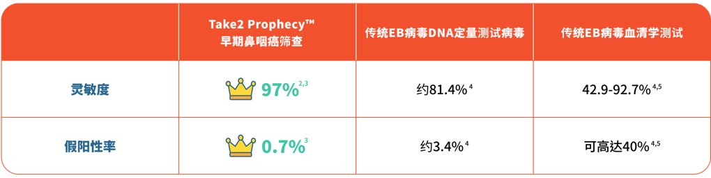

---
languages:
- zh-CN
cover:
- "../images/athlete-promo-banner-update-s-chi-01.jpg"
date: 2022-05-06T00:00:00.000+08:00
title: Take2 Health X 各大体检中心｜早期鼻咽癌筛查优惠
detail: Take2 Health X 各大体检中心｜早期鼻咽癌筛查优惠
type: ''
pdf: ''
href: ''
slug: athletes-medical-collaborations
hide: true

---

「台上一分钟，台下十年功」，运动员为了在比赛中发挥出最好成绩，都会提前准备，迎接每个挑战。可是，尽管拥有强健的体魄，都有机会被突如其来的意外打乱计划，就好像在人生高峰期患上癌症，一定会方寸大乱。

鼻咽癌是本港最常见的头颈部癌症，发病高峰期介乎40至50岁，更是20-44岁男士头号癌症¹！鼻咽癌早期病征与感冒非常相似，包括：头痛、鼻塞、耳鸣，导致患者容易混淆而忽略，到病情变得严重的时候才求医，届时癌细胞有机会已经扩散，白白错过治疗黄金期。不想每一次出现征状都要揣测？定期进行早期鼻咽癌筛查即能帮助你分辨。只需要一顿午饭的时间，到附近诊所抽血检查，就毋须再提心吊胆。

 

**灵敏度冠绝市场同类测试**

Take2 Prophecy™ 早期鼻咽癌筛查采用高通量测序技术 (Next-generation Sequencing)，来分析血浆中人类和EB病毒的DNA与鼻咽癌相关之特征，有效识别出未有明显病征的早期患者，助其及早开展治疗，而且灵敏度>97% ² ³，冠绝同类测试！

**不要犹豫，立即预约！**

**Take2 Health联合各大医疗集团推出限时鼻咽癌筛查优惠，包括：**

**1.** **Human Health 盈健医疗 - 早期鼻咽癌筛查计划 ($1,445) (优惠码：SUPERDAD)**

**分店地址：** 旺角

**网上预约**： [https://bit.ly/3LpgU6S](https://bit.ly/3LpgU6S "https://bit.ly/3LpgU6S")

**计划详情**：计划包括血液检验及由医护人员解释报告。

 

**2. JP Partners Medical 庄柏医疗 - 早期鼻咽癌筛查 ($1,500)**

**分店地址**：北角 / 中环 / 钻石山 / 九龙城 / 佐敦 / 旺角 / 荃湾 / 上水 / 屯门

**网上预约：**[https://bit.ly/3OHwU69](https://bit.ly/3OHwU69 "https://bit.ly/3OHwU69") / **WhatsApp 查询**：9011 8042

**计划详情**：计划包括医生咨询及医生分析报告及血液检查。7 – 10个工作天后有报告。

 

**3. Kinetics 毅力医护健康集团 - 鼻咽癌基因筛查 ($1,500)**

**分店地址**：铜锣湾 / 佐敦 / 荃湾 / 沙田

**网上预约**：[https://bit.ly/3NW18S1](https://bit.ly/3NW18S1 "https://bit.ly/3NW18S1") / **WhatsApp 查询及预约**：9336 8186

**计划详情**：身体检查报告将于完成检查及提供所有样本后大约4星期内发出。

 

**4. Medicare Group 匡乔医疗集团 - 鼻咽癌筛查 ($1,800)**

**分店地址**：尖沙咀

**网上预约：**[https://bit.ly/36PicJ8](https://bit.ly/36PicJ8 "https://bit.ly/36PicJ8")

**计划详情**：7天快速结果，计划包含医生解释报告。

 

**5. Medtimes 时代医疗集团 - 吸烟人士综合检查计划 ($2,980)**

**分店地址**：尖沙咀 / 上水

**网上预约：**[https://bit.ly/39VaLkY](https://bit.ly/39VaLkY "https://bit.ly/39VaLkY") / **电话预约**：3585 8533

**计划详情**：检查项目包括早期鼻咽癌筛查、基本体格检查、心脏检查、X 光检查、血脂肪、全血计数、糖尿病及医生解释报告。

 

**Medtimes 时代医疗集团 - 早期鼻咽癌筛查 ($3,000)**

**分店地址**：尖沙咀 / 上水

**网上预约：**[https://bit.ly/3NCYL5Y](https://bit.ly/3NCYL5Y "https://bit.ly/3NCYL5Y") / **电话预约**：3585 8533

**计划详情**：计划包括早期鼻咽癌筛查 (不包括医生解释报告)。

 

**6. New Town Medical 新都医疗 - 早期鼻咽癌筛查 ($1,800)**

**分店地址**：铜锣湾 / 观塘 / 尖沙咀 / 荃湾 / 沙田 / 元朗 / 屯门 /天水围

**网上预约：** [https://bit.ly/3ERBTfR](https://bit.ly/3ERBTfR "https://bit.ly/3ERBTfR")

**计划详情**：完成检查后，报告可另约时间，在新都医务中心内由医生讲解。

 

**7. Quality HealthCare 卓健医疗服务 - 鼻咽癌筛查计划 ($2,185) (会员价)**

**分店地址：**  
**香港岛**：中环 / 金钟 / 湾仔 / 鲗鱼涌 / 铜锣湾 / 北角 / 赤柱

**九龙**：尖沙咀 / 佐敦 / 旺角 / 九龙湾 

**新界及离岛:** 沙田 / 将军澳 / 青衣 / 东涌 / 愉景湾 / 屯门 / 元朗

**网上预约：**[https://bit.ly/3viKJ36](https://bit.ly/3viKJ36 "https://bit.ly/3viKJ36")

**计划详情**：计划包括详细病历调查、医生会诊、鼻咽癌基因检测、医生解释报告。

 

**8. Re:HEALTH 香港仁和体检 - 早期鼻咽癌筛查计划 ($2,000)**

**分店地址**：铜锣湾 / 旺角

**网上预约：**[https://bit.ly/37Hhezh](https://bit.ly/37Hhezh "https://bit.ly/37Hhezh")

**计划详情**：计划包括采集血液样本及由医护人员分析报告 (如结果为阳性，会转介咨询耳鼻喉科专家)。14个工作天后收取报告。

 

**9.** **Trinity Medical Centre 全仁医务中心 - 早期鼻咽癌综合健康检查 ($3,088)**

**分店地址**：中环 / 尖沙咀

**网上预约：**[https://bit.ly/3MPEaeI](https://bit.ly/3MPEaeI "https://bit.ly/3MPEaeI")

**计划详情**：检查项目包括早期鼻咽癌筛查、血全像、血脂肪、糖尿筛查、甲状腺评估、心脏功能评估及本中心注册医生解释检查结果。

 

**Trinity Medical Centre 全仁医务中心 - Take2 Prophecy™️ 早期鼻咽癌筛查 ($2,100)**

**分店地址**：中环 / 尖沙咀

**网上预约：**[https://bit.ly/3sWNJAD](https://bit.ly/3sWNJAD "https://bit.ly/3sWNJAD")

**计划详情**：计划包括医生诊症费用及Take2 Prophecy™ 早期鼻咽癌筛查。3-7个工作天有报告。

 

**10. V-Care - Take2 Prophecy™️ 早期鼻咽癌筛查 ($2,000)**

**分店地址**：铜锣湾 / 佐敦 / 荃湾

**网上预约：**[https://bit.ly/3vjvy9V](https://bit.ly/3vjvy9V "https://bit.ly/3vjvy9V")

**计划详情**：计划包括详细病历调查、医生会诊 / 医生视像会诊、鼻咽癌基因检测及医生解释报告。

 

**11. Virtus 尚至医疗 - Take2 Prophecy™ 早期鼻咽癌筛查计划 ($2,200)**

**分店地址**：中环 / 尖沙咀

**网上预约：**[https://bit.ly/3x3jjOr](https://bit.ly/3x3jjOr "https://bit.ly/3x3jjOr") / **电话查询及预约：**8102 2022 / **WhatsApp查询**：9325 4580

**计划详情**：计划包括Take2 Prophecy™ 血液检查及医生讲解化验报告。

 

备注：各体检中心保留随时更改其服务的价格及任何折扣优惠，而不作另行通知的权利，最终定价以各医疗集团网上价格为准。详情请参阅其网上商店或网站。

 

1\. _Overview of Hong Kong Cancer Statistics of 2018_. Hong Kong Hospital Authority, October 2020.

2\. Chan, K. C. Allen, et al. “Analysis of Plasma Epstein–Barr Virus DNA to Screen for Nasopharyngeal Cancer.” _New England Journal of Medicine_, vol. 377, no. 6, 2017, pp. 513–22.

3\. Lam, W. K. Jacky, et al. “Sequencing-Based Counting and Size Profiling of Plasma Epstein–Barr Virus DNA Enhance Population Screening of Nasopharyngeal Carcinoma.” _Proceedings of the National_ _Academy of Sciences_, vol. 115, no. 22, 2018, pp. E5115–24.

4\. Chang, Kai-Ping, et al. “Complementary Serum Test of Antibodies to Epstein-Barr Virus Nuclear Antigen-1 and Early Antigen: A Possible Alternative for Primary Screening of Nasopharyngeal Carcinoma.” _Oral Oncology_, vol. 44, no. 8, 2008, pp. 784–92.

5\. Tay, Joshua K., et al. “Screening in Nasopharyngeal Carcinoma: Current Strategies and Future Directions.” _Current Otorhinolaryngology Reports_, vol. 2, no. 1, 2013, pp. 1–7.