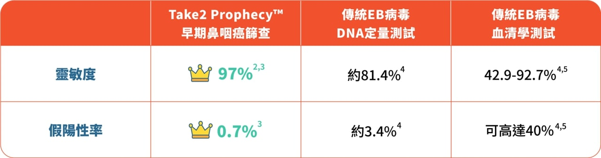

---
languages:
- zh-HK
cover:
- "../images/thumbnail-tr-300-x-600.jpg"
date: 2022-05-06T00:00:00.000+08:00
title: Take2 Health X 各大體檢中心｜早期鼻咽癌篩查優惠
detail: Take2 Health X 各大體檢中心｜早期鼻咽癌篩查優惠
type: ''
pdf: ''
href: ''
slug: athletes-medical-collaborations
hide: true

---

「台上一分鐘，台下十年功」，運動員為了上場一刻，都會預早準備，迎接每個挑戰。但即使擁有強健體魄，都有機會被突如其來的意外打亂陣腳。正如在人生高峰期時被癌症找上，也定必方寸大亂。

鼻咽癌是本港最常見的頭頸部癌症，發病高峰期介乎40至50歲，更是20-44歲男士頭號癌症¹！鼻咽癌早期病徵與感冒極為相似，包括：頭痛、鼻塞、耳鳴，故令患者容易混淆而忽略，致病情變得嚴重時才求醫，屆時癌細胞或已擴散，白白錯過治療黃金期。不想每次出現徵狀都「估估下」？定期進行早期鼻咽癌篩查即能助你分辨。只需一個午飯的時間，到附近診所抽血檢查，就毋須再提心吊膽。

 

**靈敏度冠絕市場同類測試**

Take2 Prophecy™ 早期鼻咽癌篩查採用次世代DNA測序技術 (NGS: Next-generation Sequencing)，來分析血漿中人類和EB病毒的DNA與鼻咽癌相關之特徵，有效識別出未有明顯病徵的早期患者，助其及早開展治療，而且靈敏度>97% ² ³，冠絕同類測試！

**不要猶豫，立即預約！**

**Take2 Health聯乘各大體檢中心推出限時鼻咽癌篩查優惠，包括：**

**1.** **Human Health 盈健醫療 - 早期鼻咽癌篩查計劃 ($1,445) (優惠碼：SUPERDAD)**

**分店地址：** 旺角

**網上預約**： [https://bit.ly/3LpgU6S](https://bit.ly/3LpgU6S "https://bit.ly/3LpgU6S")

**計劃詳情：** 計劃包括血液檢驗及由醫護人員解釋報告。

 

**2. JP Partners Medical 莊柏醫療 - 早期鼻咽癌篩查 ($1,500)**

**分店地址：** 北角 / 中環 / 鑽石山 / 九龍城 / 佐敦 / 旺角 / 荃灣 / 上水 / 屯門

**網上預約：** [https://bit.ly/3OHwU69](https://bit.ly/3OHwU69 "https://bit.ly/3OHwU69") / **WhatsApp 查詢**：9011 8042

**計劃詳情：** 計劃包括醫生諮詢及醫生分析報告及血液檢查。7 – 10個工作天後有報告。

 

**3. Kinetics 毅力醫護健康集團 - 鼻咽癌基因篩查 ($1,500)**

**分店地址：** 銅鑼灣 / 佐敦 / 荃灣 / 沙田

**網上預約：** [https://bit.ly/3NW18S1](https://bit.ly/3NW18S1 "https://bit.ly/3NW18S1") / **WhatsApp 查詢及預約**：9336 8186

**計劃詳情：** 身體檢查報告將於完成檢查及提供所有樣本後大約4星期內發出。

 

**4. Medicare Group 匡喬醫療集團 - 鼻咽癌篩查 ($1,800)**

**分店地址：** 尖沙咀

**網上預約：** [https://bit.ly/36PicJ8](https://bit.ly/36PicJ8 "https://bit.ly/36PicJ8")

**計劃詳情：** 7天速知結果，計劃包含醫生解釋報告。

 

**5. Medtimes 時代醫療集團 - 吸煙人士綜合檢查計劃 ($2,980)**

**分店地址：** 尖沙咀 / 上水

**網上預約：** [https://bit.ly/3vnpRYD](https://bit.ly/3vnpRYD "https://bit.ly/3vnpRYD") / **電話預約**：3585 8533

**計劃詳情：** 檢查項目包括早期鼻咽癌篩查、基本體格檢查、心臟檢查、X 光檢查、血脂肪、全血計數、糖尿病及醫生解釋報告。

 

**Medtimes 時代醫療集團 - 早期鼻咽癌篩查 ($3,000)**

**分店地址**：尖沙咀 / 上水

**網上預約：**[https://bit.ly/3KksG0I](https://bit.ly/3KksG0I "https://bit.ly/3KksG0I") / **電話預約**：3585 8533

**計劃詳情**：計劃包括早期鼻咽癌篩查 (不包括醫生解釋報告)。

 

**6. New Town Medical 新都醫療 - 早期鼻咽癌篩查 ($1,800)**

**分店地址：** 銅鑼灣 / 觀塘 / 尖沙咀 / 荃灣 / 沙田 / 元朗 /屯門 / 天水圍

**網上預約：** [https://bit.ly/3ERBTfR](https://bit.ly/3ERBTfR "https://bit.ly/3ERBTfR")

**計劃詳情：** 完成檢查後，報告可另約時間，於新都醫務中心內由醫生講解。

 

**7. Quality HealthCare 卓健醫療服務 - 鼻咽癌篩查計劃 ($2,185) (會員價)**

**分店地址：**  
**香港島:** 中環 / 金鐘 / 灣仔 / 鰂魚涌 / 銅鑼灣 / 北角 / 赤柱

**九龍:** 尖沙咀 / 佐敦 / 旺角 / 九龍灣

**新界及離島:** 沙田 / 將軍澳 / 青衣 / 東涌 / 愉景灣 / 屯門 / 元朗

**網上預約：**[https://bit.ly/3viKJ36](https://bit.ly/3viKJ36 "https://bit.ly/3viKJ36")

**計劃詳情：** 計劃包括詳細病歷調查、醫生會診、鼻咽癌基因檢測、醫生解釋報告。

 

**8. Re:HEALTH 香港仁和體檢 - 早期鼻咽癌篩查計劃 ($2,000)**

**分店地址**：銅鑼灣 / 旺角

**網上預約：** [https://bit.ly/37Hhezh](https://bit.ly/37Hhezh "https://bit.ly/37Hhezh")

**計劃詳情**：計劃包括採集血液樣本及由醫護人員分析報告 (如結果為陽性，會轉介諮詢耳鼻喉科專家)。14個工作天後收取報告。

 

**9.** **Trinity Medical Centre 全仁醫務中心 - 早期鼻咽癌綜合健康檢查 ($3,088)**

**分店地址：** 中環 / 尖沙咀

**網上預約：** [https://bit.ly/3virsPf](https://bit.ly/3virsPf "https://bit.ly/3virsPf")

**計劃詳情**：檢查項目包括早期鼻咽癌篩查、血全像、血脂肪、糖尿篩查、甲狀腺評估、心臟功能評估及本中心註冊醫生解釋檢查結果。

 

**Trinity Medical Centre 全仁醫務中心  - Take2 Prophecy™️ 早期鼻咽癌篩查 ($2,100)**

**分店地址**：中環 / 尖沙咀

**網上預約：**[https://bit.ly/38w3iYB](https://bit.ly/38w3iYB "https://bit.ly/38w3iYB")

**計劃詳情**：計劃包括醫生診症費用及Take2 Prophecy™ 早期鼻咽癌篩查。3-7個工作天有報告。

 

**10. V-Care - Take2 Prophecy™️ 早期鼻咽癌篩查 ($2,000)**

**分店地址：** 銅鑼灣 / 佐敦 / 荃灣

**網上預約：** [https://bit.ly/3vjvy9V](https://bit.ly/3vjvy9V "https://bit.ly/3vjvy9V")

**計劃詳情：** 計劃包括詳細病歷調查、醫生會診 / 醫生視像會診、鼻咽癌基因檢測及醫生解釋報告。

 

**11. Virtus 尚至醫療 - Take2 Prophecy™ 早期鼻咽癌篩查計劃 ($2,200)**

**分店地址**：中環 / 尖沙咀

**網上預約：**[https://bit.ly/3x3jjOr](https://bit.ly/3x3jjOr "https://bit.ly/3x3jjOr") **/ 電話查詢及預約：** 8102 2022 / **WhatsApp查詢**：9325 4580

**計劃詳情**：計劃包括Take2 Prophecy™ 血液檢查及醫生講解化驗報告。

 

 

備註：各體檢中心保留隨時更改其服務的價格及任何折扣優惠，而不作另行通知的權利，最終定價以各醫療集團網上價格為準。詳情請參閱其網上商店或網站。

 

1\. _Overview of Hong Kong Cancer Statistics of 2018_. Hong Kong Hospital Authority, October 2020.

2\. Chan, K. C. Allen, et al. “Analysis of Plasma Epstein–Barr Virus DNA to Screen for Nasopharyngeal Cancer.” _New England Journal of Medicine_, vol. 377, no. 6, 2017, pp. 513–22.

3\. Lam, W. K. Jacky, et al. “Sequencing-Based Counting and Size Profiling of Plasma Epstein–Barr Virus DNA Enhance Population Screening of Nasopharyngeal Carcinoma.” _Proceedings of the National_ _Academy of Sciences_, vol. 115, no. 22, 2018, pp. E5115–24.

4\. Chang, Kai-Ping, et al. “Complementary Serum Test of Antibodies to Epstein-Barr Virus Nuclear Antigen-1 and Early Antigen: A Possible Alternative for Primary Screening of Nasopharyngeal Carcinoma.” _Oral Oncology_, vol. 44, no. 8, 2008, pp. 784–92.

5\. Tay, Joshua K., et al. “Screening in Nasopharyngeal Carcinoma: Current Strategies and Future Directions.” _Current Otorhinolaryngology Reports_, vol. 2, no. 1, 2013, pp. 1–7.