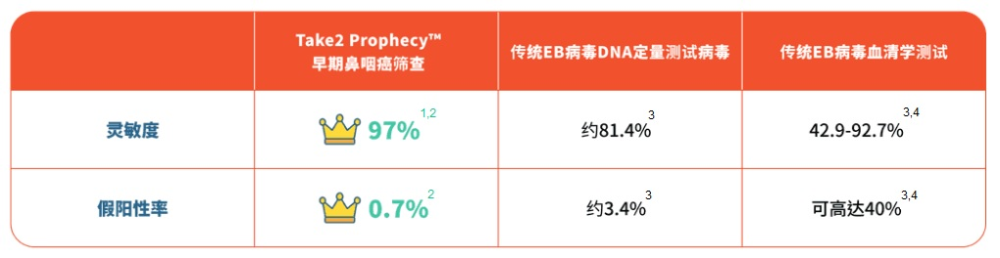

早期鼻咽癌的征状与伤风感冒极相似，包括头痛、鼻塞、耳鸣，其普遍程度有如十个港人有九个都曾出现以上病征。 不少人都会选择自行服药「头痛医头、脚痛医脚」; 正因为没有正视持续出现的病征，部分鼻咽癌患者或会待到身体出现更严重的问题如：颈淋巴结肿大、 脸部麻木、吞咽困难等才求诊，以致错过黄金治疗期，大大增加治疗的难度。

Take2 Prophecy™ 是一项无创早期鼻咽癌筛查，采用次世代DNA测序技术 （NGS： Next-generation Sequencing），专门捕捉血液中的鼻咽癌DNA讯号， 即可有效识别出未有明显病征的早期患者，提高其成功治疗的可能性及存活率; 其灵敏度更高于97%¹ ²，冠绝市场上同类测试！

__只需一顿午饭的时间，在附近诊所进行抽血，3-7个工作天就有结果 *__

**不要犹豫，立即预约！**

 

Take2 Health联同各大体检中心推出限时早期鼻咽癌筛查优惠，包括：

 

**1. 新都医疗 New Town Medical - 早期鼻咽癌筛查 ($1,800)**

**分店地址：** 沙田 / 元朗 / 屯门 / 天水围 / 荃湾 / 观塘 / 尖沙咀

**网上预约**： [https://bit.ly/3ERBTfR](https://bit.ly/3ERBTfR "https://bit.ly/3ERBTfR") / **WhatsApp 查询**：5100 8909

**计划详情：** 包括鼻咽癌血液检验及由医护人员解释报告。

 

**2. 庄柏医疗 JP Partners Medical - 早期鼻咽癌筛查 ($1,500)**

**分店地址：** 屯门 / 上水 / 荃湾 / 东涌 / 佐敦 / 旺角 / 九龙城 / 钻石山 / 北角 / 中环

**网上预约：** [https://bit.ly/3OHwU69](https://bit.ly/3OHwU69 "https://bit.ly/3OHwU69") **WhatsApp 查询** ：9011 8042

**计划详情：** 包括医生咨询、医生分析报告及鼻咽癌血液检查。

 

**3. Bowtie & JP Health – 早期鼻咽癌筛查 ($1,500)**

**诊所地址：** 湾仔

**网上预约：**[https://bit.ly/3QjbQT4](https://bit.ly/3QjbQT4 "https://bit.ly/3QjbQT4")

**查询电话：** 3169 2269

**计划详情：** 包括医生咨询、医生分析报告及鼻咽癌血液检查。

 

**4. 中环专科 The Central Health Center - 早期鼻咽癌筛查 ($1,850)**

**诊所地址：** 中环

**诊所电话：** 3180 9808

**Whatsapp 微信：** 5543 0000

**计划详情：** 包括医生咨询、医生分析报告及鼻咽癌血液检查。

 

**5. 富康医疗 Wellington Medical Centre - 早期鼻咽癌筛查 ($2,500)**

**诊所地址：** 铜锣湾 / 荃湾

**查询电话**： 2802 3058 / **WhatsApp 查询**：9467 4665

**计划详情：** 包括医生咨询、医生分析报告及鼻咽癌血液检查。

 

**优惠期至2022年11月30日**

 

备注：各体检中心保留随时更改其服务的价格及任何折扣优惠，而不作另行通知的权利，最终定价以各医疗集团网上价格为准。 详情请参阅其网上商店或网站。

\*在血液样本到达化验室后约3-7个工作天能完成分析，受疫情影响时间可能有所延长。

 

参考资料

1 Chan, K. C. Allen, et al. “Analysis of Plasma Epstein–Barr Virus DNA to Screen for Nasopharyngeal Cancer.” _New England Journal of Medicine,_ vol. 377, no. 6, 2017, pp. 513–22.

2 Lam, W. K. Jacky, et al. “Sequencing-Based Counting and Size Profiling of Plasma Epstein–Barr Virus DNA Enhance Population Screening of Nasopharyngeal Carcinoma.” _Proceedings of the National Academy of Sciences,_ vol. 115, no. 22, 2018, pp. E5115–24.

3 Chang, Kai-Ping, et al. “Complementary Serum Test of Antibodies to Epstein-Barr Virus Nuclear Antigen-1 and Early Antigen: A Possible Alternative for Primary Screening of Nasopharyngeal Carcinoma.” _Oral Oncology,_ vol. 44, no. 8, 2008, pp. 784–92.

4 Tay, Joshua K., et al. “Screening in Nasopharyngeal Carcinoma: Current Strategies and Future Directions.” _Current Otorhinolaryngology Reports,_ vol. 2, no. 1, 2013, pp. 1–7.