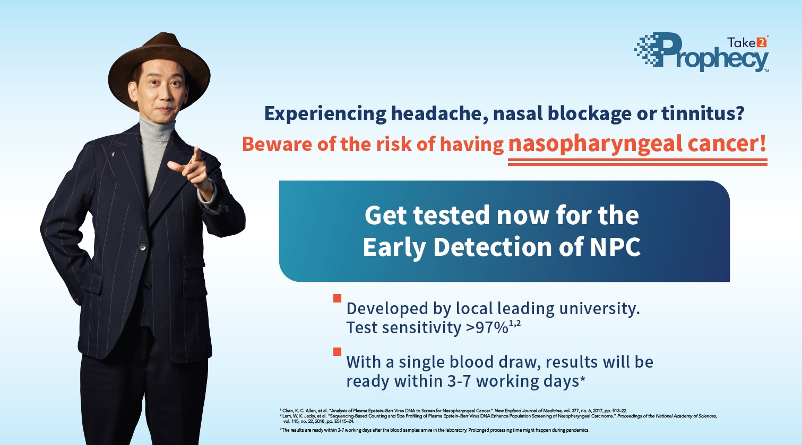
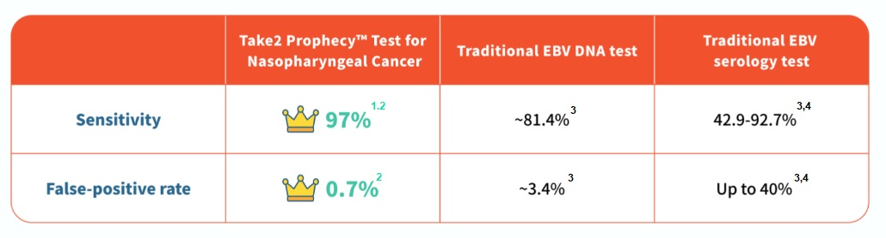

The symptoms of early nasopharyngeal cancer (NPC) are very similar to those of common cold and flu, including headache, nasal blockage, and tinnitus. It is as common as 9 out of 10 Hong Kong people may experience these symptoms. So, it is typically easy to let our guard down and rely on over-the-counter medications even when the symptoms persist. Unfortunately, these symptoms could become more serious and some patients will only seek medical advice after suffering from serious problems such as neck swelling, facial numbness, swallowing difficulty, etc. This results in missing the best timing for treatment, which also increasing the treatment complexity.

Take2 Prophecy™ is a non-invasive early NPC detection test, it uses Next-generation Sequencing (NGS) technology to capture the NPC-associated EBV DNA signal in the bloodstream. It can effectively identify NPC patients in their early-stage for timely treatment and increases their survival rate. The test shows sensitivity of greater than 97% ¹ ², which also ranks the top over other similar tests!

__Just within a lunchtime period, you will be able to get tested by undergoing simple blood draw at your nearby clinic. The result will be ready in 3-7 working days*__

**Grab the chance to enjoy our Limited Period Promotion with Medical Centres, make an appointment now!**

 

Take2 Health has launched Limited Period Promotion for Take2 Prophecy™ Test for NPC in collaboration with major medical centres as follows:

 

**1. New Town Medical – Early Detection Test for NPC ($1,800)**

**Locations**: Shatin / Yuen Long / Tuen Mun / Tin Shui Wai / Tsuen Wan / Kwun Tong / Tsim Sha Tsui

**Online booking**: [https://bit.ly/3ERBTfR](https://bit.ly/3ERBTfR "https://bit.ly/3ERBTfR") / **WhatsApp enquiry:** 5100 8909

**Details:** The plan includes blood test for NPC and report explanation by doctor. Upon completion of the test, the report will be explained by the doctor at New Town Medical Centre at a separate time.

 

**2. JP Partners Medical – Early Detection Test for NPC ($1,500)**

**Locations**: Tuen Mun / Sheung Shui / Tsuen Wan / Tung Chung / Jordan / Mong Kok / Kowloon City / Diamond Hill / North Point / Central

**Online booking**: [https://bit.ly/3OHwU69](https://bit.ly/3OHwU69 "https://bit.ly/3OHwU69") / **WhatsApp enquiry:** 9011 8042

**Details:** The plan includes doctor consultation, report explanation by doctor, and blood test for NPC

 

**3. Bowtie & JP Health – Early Detection Test for NPC ($1,500)**

**Location**: Wan Chai

**Online booking**: [https://bit.ly/3RT4CXC](https://bit.ly/3RT4CXC "https://bit.ly/3RT4CXC")

**Enquiry**: 3169 2269

**Details:** The plan includes doctor consultation, report explanation, and blood test for NPC

 

**4. The Central Clinic – Early Detection Test for NPC ($1,850)**

**Locations**: Central

**Clinic Tel:** 3180 9808

**Whatsapp / WeChat**: 5543 0000

**Details:** The plan includes doctor consultation, report explanation, and blood test for NPC

 

**5. Wellington Medical Centre – Early Detection Test for NPC ($2,500)**

**Locations**: Causeway Bay / Tsuen Wan

**Enquiry:** 2802 3058 / **WhatsApp enquiry**: 9467 4665

**Details:** The plan includes doctor consultation, report explanation, and blood test for NPC

 

**Promotion period ended on 30 November 2022**

 

Remarks: Each medical centre reserves the right to change the price and discounts at any time without prior notice. The price listed on each medical centre’s website shall be considered final.

\*The results are ready within 3-7 working days after the blood samples arrive in the laboratory. Prolonged processing time might happen during pandemics.

 

References

1 Chan, K. C. Allen, et al. “Analysis of Plasma Epstein–Barr Virus DNA to Screen for Nasopharyngeal Cancer.” _New England Journal of Medicine,_ vol. 377, no. 6, 2017, pp. 513–22.

2 Lam, W. K. Jacky, et al. “Sequencing-Based Counting and Size Profiling of Plasma Epstein–Barr Virus DNA Enhance Population Screening of Nasopharyngeal Carcinoma.” _Proceedings of the National Academy of Sciences,_ vol. 115, no. 22, 2018, pp. E5115–24.

3 Chang, Kai-Ping, et al. “Complementary Serum Test of Antibodies to Epstein-Barr Virus Nuclear Antigen-1 and Early Antigen: A Possible Alternative for Primary Screening of Nasopharyngeal Carcinoma.” _Oral Oncology,_ vol. 44, no. 8, 2008, pp. 784–92.

4 Tay, Joshua K., et al. “Screening in Nasopharyngeal Carcinoma: Current Strategies and Future Directions.” _Current Otorhinolaryngology Reports,_ vol. 2, no. 1, 2013, pp. 1–7.