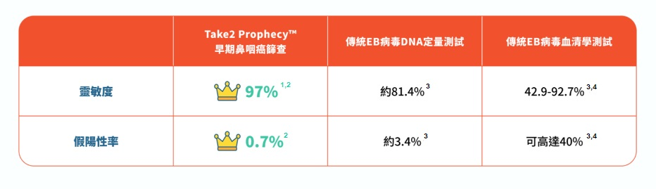

早期鼻咽癌的徵狀與傷風感冒極相似，包括頭痛、鼻塞、耳鳴，其普遍程度有如十個港人有九個都曾出現以上病徵。不少人都會選擇自行服用成藥「頭痛醫頭、腳痛醫腳」；正因為沒有正視持續出現的病徵，部分鼻咽癌患者或會待到身體出現更嚴重的問題如：頸淋巴結腫大、臉部麻木、吞嚥困難等才求醫，以致錯過黃金治療期，大大增加治療的難度。

Take2 Prophecy™ 是一項無創早期鼻咽癌篩查，採用次世代DNA測序技術 (NGS: Next-generation Sequencing)，專門捕捉血液中的鼻咽癌DNA訊號，即可有效識別出未有明顯病徵的早期患者，提高其成功治療的可能性及存活率；其靈敏度更高於97%¹ ²，冠絕市場上同類測試！

__只需一頓午飯的時間，在附近診所進行抽血，3-7個工作天就有結果 *__

**不要猶豫，立即預約！**

 

Take2 Health聯乘各大體檢中心推出限時鼻咽癌篩查優惠，包括：

 

**1. 新都醫療 New Town Medical - 早期鼻咽癌篩查 ($1,600)**

**分店地址：** 沙田 / 元朗 / 屯門 / 天水圍 / 荃灣 / 觀塘 / 尖沙咀

**網上預約**： [https://bit.ly/3ERBTfR](https://bit.ly/3ERBTfR "https://bit.ly/3ERBTfR") / **WhatsApp 查詢**：5100 8909

**計劃詳情：** 包括鼻咽癌血液檢驗及由醫護人員解釋報告。

 

**2. 莊柏醫療 JP Partners Medical - 早期鼻咽癌篩查 ($1,500)**

**分店地址：** 屯門 / 上水 / 荃灣 / 東涌 / 佐敦 / 旺角 / 九龍城 / 鑽石山 / 北角 / 中環

**網上預約：** [https://bit.ly/3OHwU69](https://bit.ly/3OHwU69 "https://bit.ly/3OHwU69") / **WhatsApp 查詢**：9011 8042

**計劃詳情：** 包括醫生諮詢、醫生分析報告及鼻咽癌血液檢查。

 

**3. Bowtie & JP Health – 早期鼻咽癌篩查 ($1,500)**

**診所地址：** 灣仔

**網上預約：**[https://bit.ly/3QjbQT4](https://bit.ly/3QjbQT4 "https://bit.ly/3QjbQT4")

**查詢電話**：3169 2269

**計劃詳情**：包括醫生諮詢、醫生分析報告及鼻咽癌血液檢查。

 

**4. 中環專科The Central Health Center - 早期鼻咽癌篩查 ($1,850)**

**診所地址：** 中環

**診所電話**： 3180 9808

**Whatsapp / WeChat**: 5543 0000

**計劃詳情：** 包括醫生諮詢、醫生分析報告及鼻咽癌血液檢查。

 

**5. 富康醫療 Wellington Medical Centre - 早期鼻咽癌篩查 ($2,500)**

**診所地址：** 銅鑼灣 / 荃灣

**查詢電話**： 2802 3058 / **WhatsApp 查詢**：9467 4665

**計劃詳情：** 包括醫生諮詢、醫生分析報告及鼻咽癌血液檢查。

 

**優惠期至2022年11月30日**

 

備註：各體檢中心保留隨時更改其服務的價格及任何折扣優惠，而不作另行通知的權利，最終定價以各醫療集團網上價格為準。詳情請參閱其網上商店或網站。

\*在血液樣本到達化驗室後約3-7個工作天能完成分析，受疫情影響時間可能有所延長

 

參考資料

1 Chan, K. C. Allen, et al. “Analysis of Plasma Epstein–Barr Virus DNA to Screen for Nasopharyngeal Cancer.” _New England Journal of Medicine,_ vol. 377, no. 6, 2017, pp. 513–22.

2 Lam, W. K. Jacky, et al. “Sequencing-Based Counting and Size Profiling of Plasma Epstein–Barr Virus DNA Enhance Population Screening of Nasopharyngeal Carcinoma.” _Proceedings of the National Academy of Sciences,_ vol. 115, no. 22, 2018, pp. E5115–24.

3 Chang, Kai-Ping, et al. “Complementary Serum Test of Antibodies to Epstein-Barr Virus Nuclear Antigen-1 and Early Antigen: A Possible Alternative for Primary Screening of Nasopharyngeal Carcinoma.” _Oral Oncology,_ vol. 44, no. 8, 2008, pp. 784–92.

4 Tay, Joshua K., et al. “Screening in Nasopharyngeal Carcinoma: Current Strategies and Future Directions.” _Current Otorhinolaryngology Reports,_ vol. 2, no. 1, 2013, pp. 1–7.