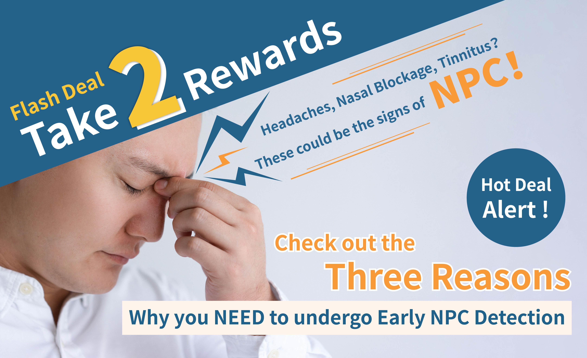
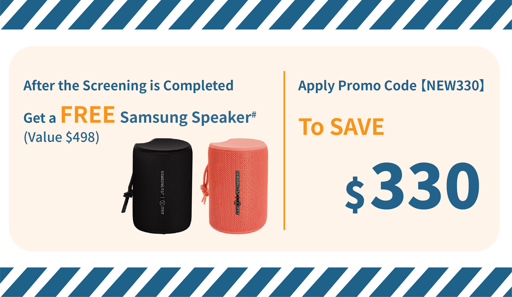
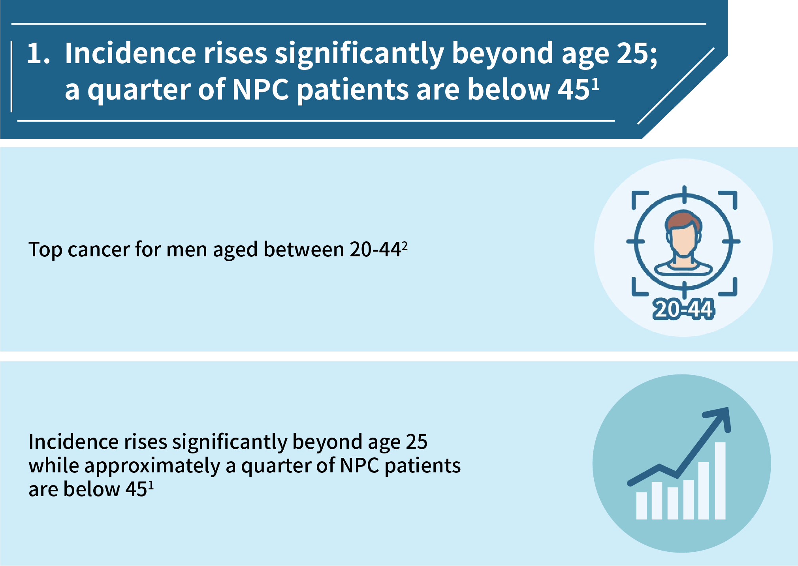
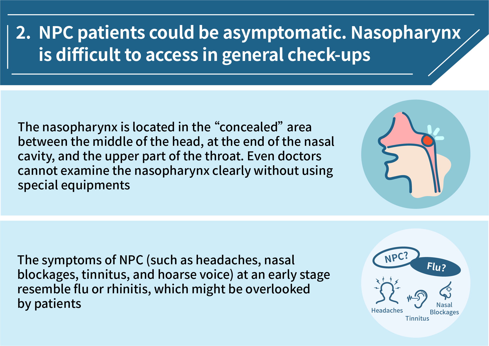
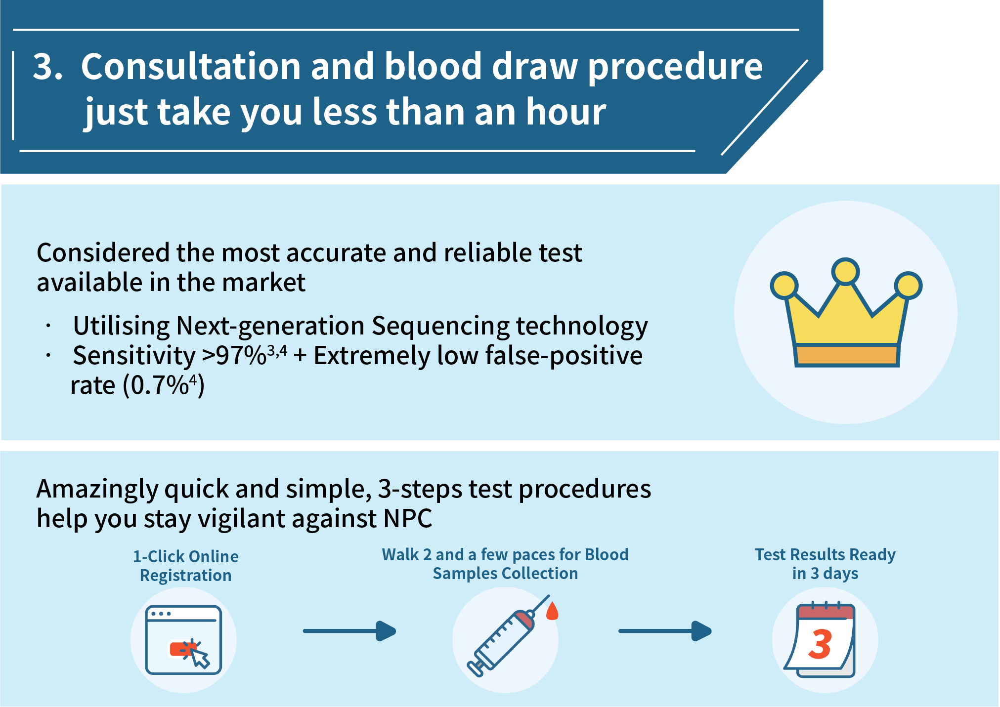

---
languages:
- en
cover:
- "../images/english-600x300.jpg"
date: 2022-08-01T00:00:00.000+08:00
title: "【Take2 Rewards】Unbeatable flash offers　Schedule a check and invest in your
  health now"
detail: 'Phase II consumption vouchers are going to be disbursed on 7 August. Don’t
  miss our biggest offer, save the most and invest in your health! '
type: ''
pdf: ''
href: ''
slug: take2-rewards
hide: true

---

### **Book Now:** [https://bit.ly/37XYNpY](https://bit.ly/37XYNpY "https://bit.ly/37XYNpY")

 

### Phase II consumption vouchers are going to be disbursed on 7 August. Don’t miss our biggest offer, save the most and invest in your health!

 

## Limited time only!　Enjoy double rewards and save more than $800

**Reward one**: Earn a Samsung C&T ITFIT IPX7 Waterproof Bluetooth Speaker (value: HKD498) when you purchase the Take2 Prophecy™ Test for Nasopharyngeal Cancer (single test item) on Take2 Health Platform on or before 31 August 2022 and complete the blood-draw on or before 5 September 2022 **FOR FREE**.

\#Rewards are available while stock lasts.

 

**Reward two**: Enter promo code “NEW330” during checkout to enjoy an extra $330 off (original price: $2,200).

Act now and save more than $800 with these unbeatable offers!

### **Book Now:** [https://bit.ly/37XYNpY](https://bit.ly/37XYNpY "https://bit.ly/37XYNpY")

 

## Check out the three reasons why you should get tested with Take2 Prophecy™ Test for Nasopharyngeal Cancer!

 

 

The earlier you know, the better you can manage. The survival rate of early-stage NPC patients can be higher than 90%².

### **Book Now:** [https://bit.ly/37XYNpY](https://bit.ly/37XYNpY "https://bit.ly/37XYNpY")

Terms and Conditions apply.

The styles, patterns, and colours of the gifts will be offered on a random and first-come-first-served basis. Available while stock lasts.

Take2 Health Platform supports bookings 3 days ahead, while the actual appointment is subject to the clinic's availability.

 

1 _Hong Kong Cancer Registry_. Hong Kong Hospital Authority, www3.ha.org.hk/cancereg/. Accessed 23 May 2021.

2 _Overview of Hong Kong Cancer Statistics of 2019_. Hong Kong Cancer Registry. Hong Kong Hospital Authority, October 2021

3 Chan, K. C. Allen, et al. “Analysis of Plasma Epstein–Barr Virus DNA to Screen for Nasopharyngeal Cancer.” _New England Journal of Medicine_, vol. 377, no. 6, 2017, pp. 513–22.

4 Lam, W. K. Jacky, et al. “Sequencing-Based Counting and Size Profiling of Plasma Epstein–Barr Virus DNA Enhance Population Screening of Nasopharyngeal Carcinoma.” _Proceedings of the National_ _Academy of Sciences_, vol. 115, no. 22, 2018, pp. E5115–24.

 

“Take2 Rewards” Promotion ( “Promotion”) Terms and Conditions (“Terms”)

1\. Below Terms apply to the Promotion offered by Take2 Health Limited (“we”, “us”, “our”). By participating in the Promotion, you agree to the Terms below.

2\. You must read these Terms along with the [Privacy Policy](https://take2health.net/en/terms-and-conditions/privacy-policy), [Terms of Use](https://take2health.net/en/terms-and-conditions/website-terms-of-use/), [Personal Information Collection Statement](https://take2health.net/en/terms-and-conditions/personal-information-collection-statement/) on our Website (“Website”: take2health.net), [Take2 Health Platform Privacy Policy](https://take2health.net/health-platform/agreement/2), [Take2 Health Platform Terms and Conditions](https://take2health.net/health-platform/agreement/3), [Take2 Health Platform Personal Information Collection Statement](https://take2health.net/health-platform/agreement/1), and any other terms we may provide to you (“Other Terms”). In addition to these terms, any Other Terms also apply.

3\. Any use of the word “Double” and “Twice” on the related marketing materials of the Promotion means that it includes the “NEW330” Promotion Code Promotion (“NEW330 Promotion”) and the Promotion offer. NEW330 Promotion and this Promotion could be applied independently. This Promotion only indicates the offer listed in Clause 4 of this Terms. (To enjoy the NEW330 Promotion, you shall meet the listed requirements in its respective Terms and Conditions. For details: [“NEW330” Promotion Code Promotion (the “Promotion”) Terms and Conditions](https://take2health.net/en/whats-new/promotions/new330-tnc) )

4\. To participate in this Promotion and be eligible for the complimentary gift -- Samsung C&T ITFIT IPX7 Waterproof Bluetooth Speaker (1 pc, value: HKD498) (“Gift”), you must:

a. solely purchase the Take2 Prophecy™ Test for Nasopharyngeal Cancer (single test item) (“Test”) within the promotion period from 1 August 2022 to 31 August 2022, both dates inclusive ("Promotion Period”), on the Take2 Health Platform [https://take2health.net/health-platform/](https://take2health.net/health-platform/ "https://take2health.net/health-platform/") ;

b. register as the Take2 Extra Care member ;

c. complete the payment procedure successfully (“Eligible Appointment”) and blood-drawing procedure on or before 5 September 2022. You may refer to Clause 7 for the definition of the successful payment procedure.

5\. The styles, patterns, and colours of the Gift will be offered on a random and first-come-first-served basis. The supply of gifts is subject to availability. We reserve the right to replace the Gift with any other items/ vouchers/ rewards without prior notice, if the Gift runs out of stock. The value of the replaced items/ vouchers/ rewards might not have the same value as the Gifts or with similar nature.

6\. The purchasing date and time (all records shall reference GMT+08:00, Hong Kong Standard Time) of all Eligible Appointments are based on the time of receipt by our server. We will not be liable for any matter or loss in relation to submission delay, loss, and any information transmission error due to technical problems including but not limited to any computer or internet network issues.

7\. A successful completion of payment is based on the transaction records of financial institutions held by us and the final decision is made at its absolute discretion (if there is any discrepancy, the transaction records of financial institutions held by us shall prevail).

8\. In the event of any cancellation of Eligible Appointments or refunds, your eligibility to receive the Gift shall be voided.

9\. The Gift does not include any warranty and is neither transferrable, returnable nor exchangeable for cash or any other form of compensation.

10\. We are not the supplier of the Gift for the Promotion, and make no representations or guarantees for the Gift, therefore all aspects of the Gifts (including but not limited to the quality and availability) are not within our responsibility. If you have any disputes or complaints about Gift, you should contact the relevant supplier directly

11\. Photos or images of the Gift are for reference only and may be slightly different from the actual item. Any complaints about the difference shall not be entertained.

12\. If you fail to redeem the entitled Gift at the designated location by presenting the valid supporting documents within the redemption period, it is deemed as to renounce the claim of the entitled Gift. The respective gift redemption letter and details will be sent to the registered email address no later than 9 September 2022. Please refer to the email received for redemption guidelines.

13\. This Promotion is applicable to the designated products or services specified by us and does not apply to services and products made available and sold by third-party medical service and/or testing service providers.

14\. We reserve the rights at any time, without prior notice or reason and in our sole discretion, to:

a. change, modify, suspend, or terminate the Promotion or these Terms (including any offer or discount);

b. make any decision in connection with the Promotion (including refuse or suspend your participation in the Promotion or determine whether the Promotion can or cannot be combined with any other offer or promotion); and

c. determine that the promotion code has been used for an improper purpose and cancel your use of any such Promotion Code.

Any such rights exercised by us shall be conclusive and binding on you.

15\. If case of any dispute arises in connection with the Promotion, we reserve the right of the final decision.

16\. These Terms are governed in all respects by and construed in accordance with the laws of the Hong Kong Special Administrative Region. The parties submit to the exclusive jurisdiction of the courts of the Hong Kong Special Administrative Region.

17\. The English version of the Terms shall prevail in the event of a conflict with other language versions.

Last revision date: 1 August 2022