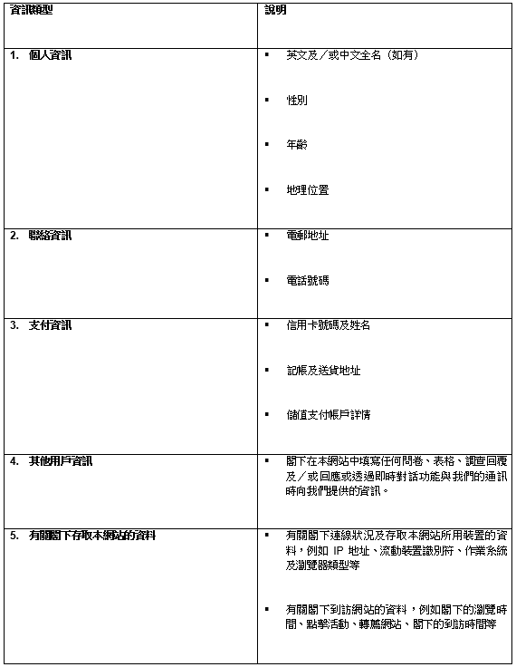
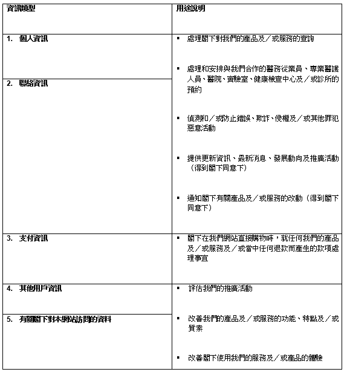

**《網站私隱政策》（「《私隱政策》」）**

**1. 引言**

Take2 Health Limited（「**我們**」或「**我們的**」）非常重視私隱。我們承諾採取適當的行政、技術及實質保障措施，以確保按照《個人資料（私隱）條例》（第 486 章）的規定合理處理和保護閣下的個人資料。

我們的《私隱政策》建基於以下關鍵原則：

1\. **透明度：**我們致力闡清收集所得的資訊類型。

2\. **簡單性：**我們將以簡單易明的語言撰寫政策，以助閣下作出明智決定。

3\. **控制權：**閣下擁有閣下的個人資料，而我們讓閣下控制箇中使用方式。

個人資料是指切實可行地存取或處理下可識別閣下身份的資訊。本《私隱政策》旨在說明我們如何處理在閣下存取或使用我們的網站（[https://take2health.net/](https://take2health.net/ "https://take2health.net/")（「**本網站**」））時從閣下收集所得的個人資料。

本網站為 18 歲或以上人士而設。我們不會蓄意向未滿 18 歲的任何人士收集資訊。如果我們知道收到此類資訊，我們將會採取合理的措施從我們的記錄尋找和移除該等資訊。若閣下未滿 18 歲，請停止使用本網站；否則請向我們提供閣下父母及／或法定監護人的書面同意，才繼續使用本網站。

**2. 個人資料收集**

就以下第 3 節所列的目的而言，本網站可能向閣下收集以下類型的資訊：

資訊類型說明 1. 個人資訊 英文及／或中文全名（如有）、性別、年齡、地理位置 2. 聯絡資訊電郵地址電話號碼 3. 支付資訊  信用卡號碼及姓名記帳及送貨地址儲值支付帳戶詳情  4. 其他用戶資訊閣下在本網站中填寫任何問卷、表格、調查回覆及／或回應或透過即時對話功能與我們的通訊時向我們提供的資訊。5. 有關閣下存取本網站的資料有關閣下連線狀況及存取本網站所用裝置的資料，例如 IP 地址、流動裝置識別符、作業系統及瀏覽器類型等有關閣下到訪網站的資料，例如閣下的瀏覽時間、點擊活動、轉薦網站、閣下的到訪時間等 。

**3. 收集目的**

收集資訊的目的如下：

資訊類型 | 用途說明 1. 個人資訊  處理閣下對我們的產品及／或服務的查詢 § 處理和安排與我們合作的醫務從業員、專業醫護人員、醫院、實驗室、健康檢查中心及／或診所的預約 § 偵測和／或防止錯誤、欺詐、侵權及／或其他罪犯惡意活動 § 提供更新資訊、最新消息、發展動向及推廣活動（得到閣下同意下） § 通知閣下有關產品及／或服務的改動（得到閣下同意下）  2. 聯絡資訊  3. 支付資訊  閣下在我們網站直接購物時，就任何我們的產品及／或服務及／或當中任何退款而產生的款項處理事宜  4. 其他用戶資訊 評估我們的推廣活動  改善我們的產品及／或服務的功能、特點及／或質素  改善閣下使用我們的服務及／或產品的體驗 5. 有關閣下對本網站訪問的資料

**4. 數碼存根 (Cookies) 政策**

當閣下正式使用本網站時，這代表閣下同意根據我們的數碼存根 (Cookies) 政策（“Cookies政策”）使用 Cookies。

(A) 甚麽是Cookies?

a. Cookies 是一種小型文字檔案，能透過瀏覽器被儲存於閣下的電腦或流動電子裝置中。Cookies 會就閣下的瀏覽器種類以不同方式呈現，並會包含一些匿名信息，例如唯一識別碼網站域名以及一些數位及數字。

b. Cookies 能協助網站分辨不同用戶的裝置，也能透過協助閣下記錄喜好而令閣下有更佳的綫上體驗。同時，Cookies 更能幫助我們了解在本網站內的瀏覽行為，從而協助我們度身訂製更適合閣下的內容。

(B) 我們正在使用哪種Cookies？

a. 必要性 (Necessary) Cookies

i. 必要性Cookies使我們能夠在閣下訪問和瀏覽本網站並使用其功能時，為閣下提供最佳體驗。 例如，這些 Cookies可讓我們識別閣下已經創建並登錄該帳戶。

b. 功能性 (Functionality) Cookies

i. 功能性 Cookies使我們能夠根據閣下所做的選擇來運營網站。 例如，我們將識別閣下的用戶名稱，並記住閣下日後使用本網站期間的個人設定。

c. 分析／效能性 (Analytical) Cookies

i. 分析/功能性Cookies使我們和第三方供應商能夠收集總匯數據，用於統計和分析各用戶如何使用本網站。 這些 Cookies旨在幫助我們改善閣下的用戶體驗，並不包含姓名和電子郵件地址等個人信息。此等第三方供應商可能將從本網站收集所得的資訊，及其在其他服務獨立收集所得的個人資訊互相關聯，此將受其各自的私隱政策管限，並將超出我們的控制範圍。

(C) 如何移除Cookies？

a. 倘若閣下需要限制或阻截本網站設置的 Cookies，閣下可以透過網頁瀏覽器設置相關設定。閣下亦可以瀏覽 [www.internetcookies.org](http://www.internetcookies.org/)，當中包含有關如何在各種網頁瀏覽器和各種裝置上執行Cookies設定的全面信息。閣下將找到有關 Cookies的一般信息以及如何從閣下的裝置中刪除 Cookies的詳細信息。

如閣下對於我們的Cookies政策或對於我們的Cookies 使用有任何問題，歡迎電郵至[info@take2.health](mailto:info@take2.health) 與我們聯絡。

**5. 第三方連結**

本網站載有第三方網站及／或社交媒體平台（包括但不限於 Facebook 及 YouTube 等）的連結。本網站列載此等連結，不構成我們認同、授權或聯繫該等網站。如閣下點擊此等連結或使用該等第三方的服務，將會離開本網站。建議閣下先查閱相關網站的私隱政策，方才與之分享閣下的個人資訊。

本網站亦結合即時對話應用程式，當中的軟件功能讓閣下以第三方軟件應用程式與我們聯絡和對話。該等第三方軟件應用程式可能識別閣下的存取資訊（例如 IP 地址），並可能擷取閣下的資訊（例如電郵地址、用戶 ID、姓名及／或連接所用的電話號碼）。另外請注意，閣下可能在與我們的對話期間自願向對話應用程式提供個人資訊。

我們不就該等第三方對閣下個人資訊的使用負上責任，且不保證其設有與我們的相同水平的資料保護政策。

**6. 披露與轉移**

我們會將閣下的個人資料保密，惟閣下確認和同意就以上第 3 節所列的目的而言，我們可能按「需知」基礎向以下各方提供資訊，其受與本《私隱政策》及適用法律相若的資料安全性及保密性合約義務規限：

(A) 我們在香港境內及／或境外的控股公司、附屬公司或聯屬公司；

(B) 閣下透過本網站與預約的相關醫務從業員、專業醫護人員、醫院、實驗室、健康檢查中心及／或診所；

(C) 獨立承辦商及／或助其向我們提供服務的其他服務供應商，包括：

– 支付網或其他支付處理服務供應商

– 醫療服務及／或檢測服務供應商

– 速遞服務供應商

– 支援我們的資料庫的雲端服務供應商

– 資料儲存及管理服務供應商

– 網站開發商

– 市場研究服務供應商

(D) 執法機關，以使我們得以遵守法律及／或規例，或任何管轄法院的任何有效命令。

為了優化閣下的網站體驗，並改善我們的產品及／或服務，閣下的個人資料可能披露和轉移至第三方資訊科技、營銷資料分析及管理服務供應商及相關實體，當中某些可能位於海外。

**7. 安全性及保留**

閣下的個人資料只會在所需的時期內予以保留。

我們將採取商業上爲之合理的措施，以保障閣下的個人資料免遭未經授權和／或意外存取、處理、刪除和／或使用。我們設有全面的安全計劃，以適當的行政、實質及技術保障措施保護閣下的個人資料，而措施水平將因應收集所得資料的敏感程度而定。

我們亦定期審視安全及私隱措施，並採取所有必需行動以改善我們的做法，從而確保閣下的個人資料免遭濫用、意外遺失或未經授權存取。縱然我們無法保證不會出現此等不利事件，我們承諾採取合理的措施以避免事件發生。

除非閣下的個人資料如第 6 節所述轉移至第三方，否則只有我們的員工方可存取閣下的個人資料，其獲授權並經培訓處理該等資料，同時負有嚴格保密義務。

**8. 資料存取及更正**

閣下有權要求存取和更正我們的所持與閣下相關的個人資料。為了處理該等要求，閣下可能需要支付合理的行政費以作處理個人資料存取之用。

閣下明白自我們收到閣下的要求起，我們可能需時處理修訂、更正和／或刪除閣下的個人資訊。我們致力在切實可行的時段以內儘快處理閣下的要求。

在某些情況下，我們可能以「去識別形式」彙整個人資料。一經彙整，該等資訊就不再被視爲個人資料，而不會受限於刪除要求。

如欲行使第 8 節所列的權利或撤回閣下先前向我們給予的任何同意，請透過郵寄或電郵發送閣下的要求：

地址：香港沙田香港科學園12W大樓5樓506室

電郵：info@take2.health

**9. 語言**

本《私隱政策》的原始英文版本可能翻譯至其他語言版本。一旦對於本《私隱政策》的內容或詮釋有所爭議，或本《私隱政策》英文版本與其他語言版本之間有所抵觸或差異，一概以英文版本為準。

**10. 管限法律及爭議解決**

本《私隱政策》須受中華人民共和國香港特別行政區（「**香港**」）的法律管限，並據之詮譯。閣下同意受香港法庭的獨有司法管轄權管限。

**11. 修訂**

本《私隱政策》可能不時修訂，經更新的政策將在我們的網站發佈。一經到訪或瀏覽本網站，或透過我們的網站提交閣下的個人資訊，即代表閣下確認、接受和同意本《私隱政策》所列的條款。

\[生效日期：2023年1月11日\]