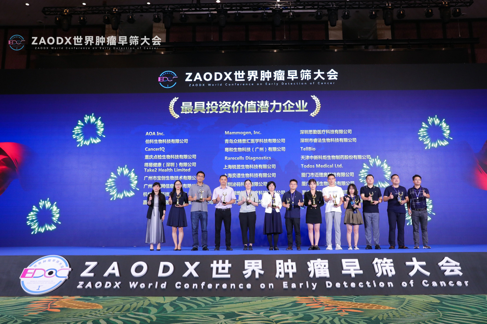
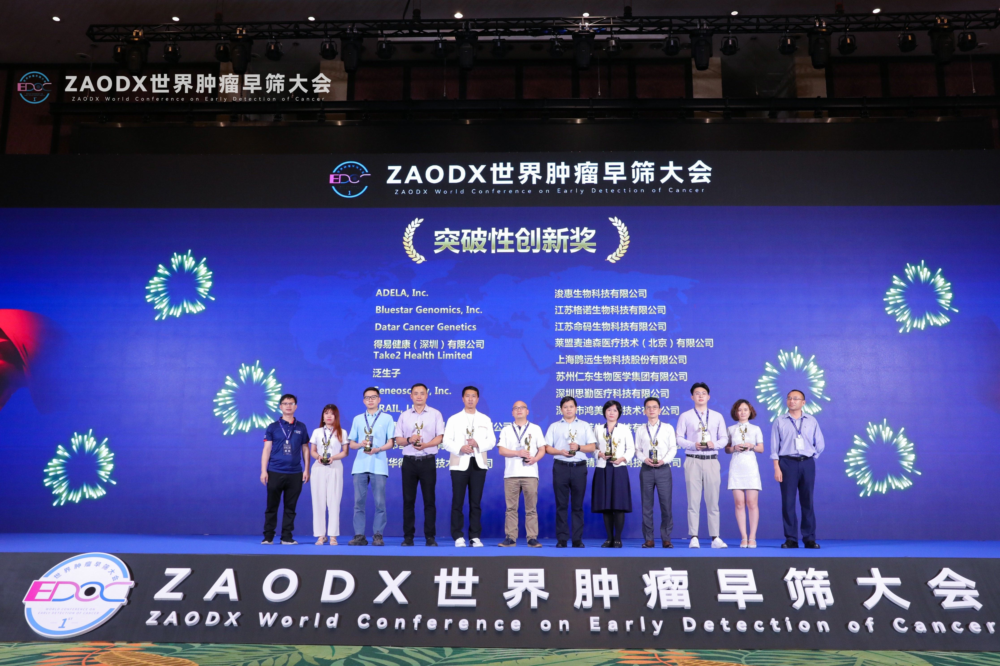
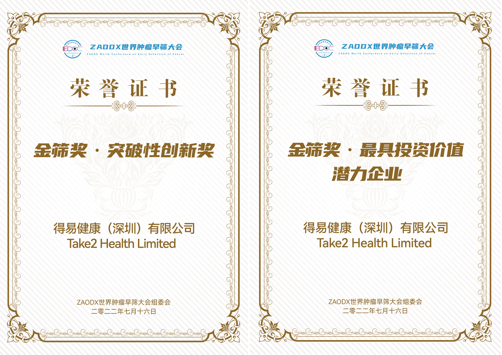
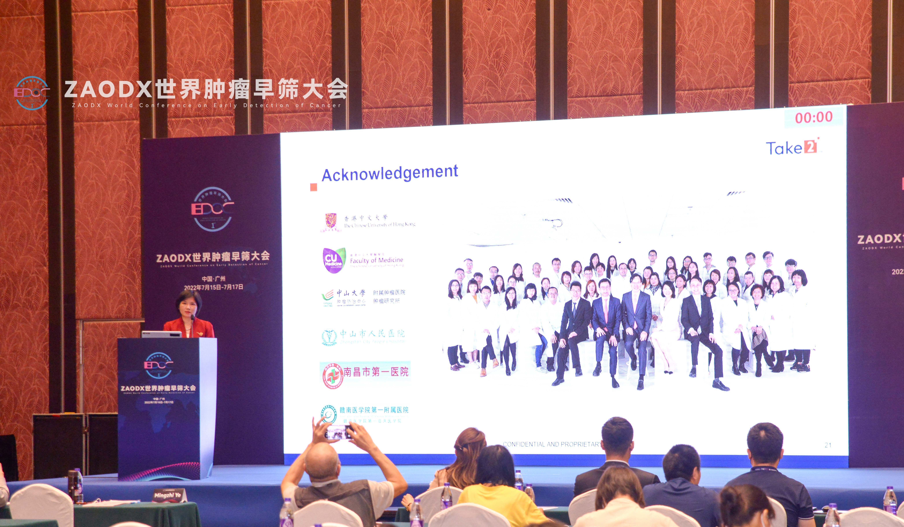

We are privileged to have participated in the first ZAODX World Conference on Early Detection of Cancer, and are very honoured to be awarded as The Company with the Most Investment Potential (金篩獎‧最具投資價值潛力企業) as well as The Top Breakthrough Innovation (金篩獎‧突破性創新獎)

 

The World Conference on Early Detection of Cancer was co-hosted by the China Anti-Cancer Association Expert Committee of Early Detection and Early Treatment, the National Innovation Center for Advanced Medical Devices, Zhong Nanshan Medical Foundation, Belt and Road Life Science Economy Alliance, and the Hainan Medical Innovation Promotion Association. Aiming to mount the efforts from esteemed professionals in the field of oncology across China and the globe, it focused on exploring medical technologies and solutions to help the world realise a shared vision for better cancer management.

 

Thrilled to have the opportunity to share our insights with the industry’s leading scientists, academicians, researchers, physicians, and business entrepreneurs, our Chief Technology Officer, Dr. Mingzhi Ye, shared how Take2 utilised our state-of-the-art genomics technologies in the screening for Nasopharyngeal Cancer (NPC), which effectively identify NPC patients at significantly earlier stages, and how Take2’s effort will immensely drive the progress of early NPC detection for better survival and health outcomes.

 

Looking forward, we will continue to dedicate ourselves to and work towards delivering progress in healthcare inventions that positively impact China’s and the world’s health communities.

