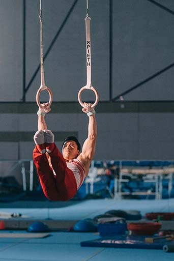
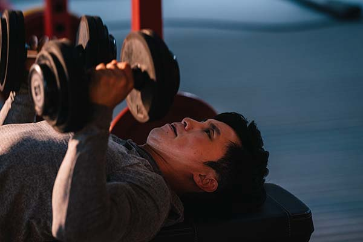
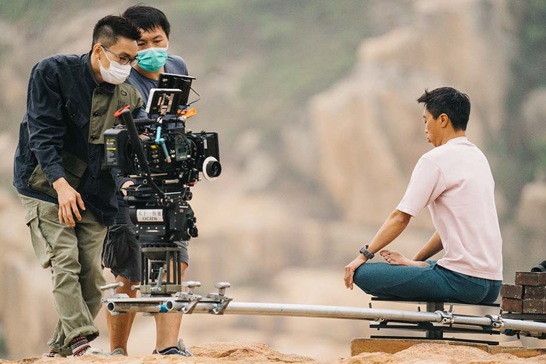
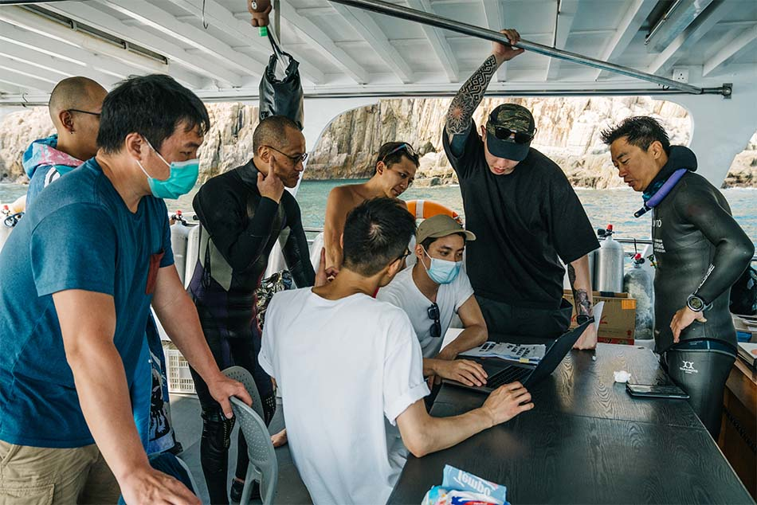
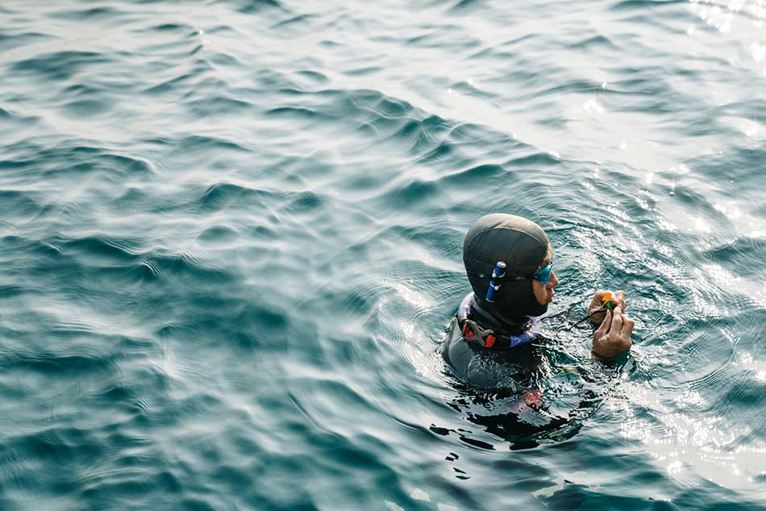
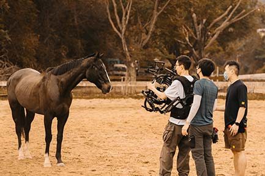

 

Hong Kong athletes continue to glow in international sports events. Their spirit of perseverance and determination to pursue excellence deserves all the applause. Take2 Health, as a start-up built from Hong Kong, also strives for perfection, aims to provide practical information, and harness the power of state-of-the-art technologies to mark the advent of a new generation of healthcare across Asia. In this campaign, we are honoured to invite four Hong Kong top athletes to get ready, and be well-prepared together to tackle the health challenges. Let’s deconstruct the details of the campaign’s hero video now!

 

 

## **To win in the games we need to get prepared in advance**

## **Same as to manage your health**

To showcase the characteristics of Hong Kong athletes meticulously, Take2 Health and the production team have conducted a comprehensive study on their training, inner journey, and daily life of the four athletes and have gone through numerous lively discussions. We have discovered the stories of the four athletes facing various challenges and difficulties under the spotlight. One significant common factor driving them to succeed is early preparation which is coincidentally consistent with our beliefs about surmounting the odds of nasopharyngeal cancer and managing our own health. Therefore, we have decided the theme of the video to be, “Always prepare early for the golden timing”!

 

 

## **Maintain a good condition**

## **Begin with staying mindful to your body**

To create the best performance, every movement has been practiced over millions of times, and every detail has been rehearsed in the mind beforehand. To achieve excellence in the games, it is vital to practice relentlessly. On the other hand, athletes need to constantly monitor and manage their body condition, even if the most subtle muscle changes cannot be missed, in order to map out the targeted training and treatment for achieving the best result. The earlier we listen to the signals sent by our body, the better we can take control of our health, as well as the circumstances to win the game.

 

Similarly, you need to get prepared in advance! To stay healthy, it is barely sufficient to maintain sound daily living habits. Instead, we should also be aware of our body conditions continually, undergo early detection, and manage the potential health risks. We get used to the hectic life when we consider ourselves healthy, and are likely to neglect the warning signal sent out from our body which might be brought by diseases, thus making us fail to manage our health properly. Are you ready to face the changes when the disease comes as a bolt out of the blue?

 

Everyone is the same; the earlier we get prepared, the easier we can organise our lives to face the challenges composedly. Therefore, we partner with the four athletes to bring out this campaign, aiming at informing everyone the principle of "Cure NPC earlier by knowing it earlier", hence protecting everyone's health with state-of-the-art technologies.

 

 

## **Reveal the four athlete protagonists**

## **Fully disclose the footage of the making-of**

 

### _The first two protagonists: Stone and Kelvin_

 

Shek Wai Hung (Stone), the Hong Kong gymnast, is specialised in the vault. In 2010, he represented Hong Kong to compete in the Asian Games men’s vault for the first time and won his first Olympic entrance ticket after two years, becoming the first gymnastics Olympian from Hong Kong.

 

Ng Kiu Chung (Kelvin), the Hong Kong gymnast, is known for the name of “Lord of the Rings”. He has won numerous global prizes in his gymnast career and has successfully made two elements on rings to be named after him.

 

To let Stone and Kelvin get used to the shooting condition with ease, the production team has done a series of preparation, including collecting information in detail, and understanding the daily habits and schedules of Stone and Kelvin from interviews. Knowing that the Hong Kong gymnastics team is currently training at Shun Lee Estate Sports Centre, which is equipped with various professional facilities, including rings, vaults, uneven bars, pommel horses, and balance beams, we immediately decided to use the centre as the shooting venue, to relieve Stone and Kelvin's nervousness and ensure they could complete the shooting in a safe environment, avoiding injuries because of the stress of shooting.

 

 

 

 

(Production team was conceiving of each camera angle and shot seriously)

 

Moreover, to make the scenes more realistic and textured, Stone and Kelvin fully concentrated on performing the shooting moves. They did the movements over and over again for the cameramen to shoot from different angles, and capture as much detail as they could to construct the most perfect scenes. Their seriousness, professionalism and solid skills could be seen from their jumps, leaps and turns, as if they were competing in the Olympic Games.

 

 

 

 

 

(Stone and Kelvin performed their daily training seriously)

 

 

 

 

(Stone repeatedly performed his iconic moves to strive for perfection)

 

### _The third protagonist: Chris_

 

Cheung Lap Hing (Chris) is the current Hong Kong freediving record holder and the president of the Hong Kong Freediving Association. In the earlier regional competition, he has broken the Hong Kong freediving record in three disciplines (Static Apnea, Dynamic With Bi-Fins, and Dynamic Without Fins), winning the men’s overall championship.

 

Freediving is still not a popular sport in Hong Kong, and therefore the production team consulted Chris about his training routine before the shooting. Without any equipment, diving into the deep sea with bare hands, he entered an underwater world full of uncertainty. Chris stated that the only controllable factors are his body and mind. Therefore, he would stabilise his body condition through daily training, which has also become his main shooting content. Many scenes about his practice of yoga and meditation can be seen in the video.

 

Chris explained that practicing yoga can increase his body flexibility which helps to improve his mobility in the water. In addition, by mastering the technique of diaphragmatic breathing and meditation, he keeps himself calm, brings awareness to different body parts, and gets relaxed. All these help the free divers use their muscles more efficiently, reduce physical exertion, and thereby reduce oxygen consumption.

 

 

 

(Many scenes about Chris practicing yoga and doing meditation could be seen)

 

Of course, talking about freediving, outdoor shooting is inevitable. To assist in having a smooth shooting, Chris has provided full support in the preparation phase. For instance, since Chris is familiar with the changes in weather and the sea, he shared a lot of knowledge about weather prediction such that the production team was able to choose a suitable shooting venue at the end.

 

 

 

(Chris served as our “Observatory” and provided a lot of weather information)

 

P.S. We wanted to share a little surprise that we found during the filming. We are glad to invite special guests during the shooting, the two daughters of Chris. Apart from being a freediving champion, Chris is also a loving father. At the shooting venue, the two daughters performed several yoga movements such as splitting. Coupled with their joyful conversations and interactions, it is shown that they have close rapport and created a pleasant shooting atmosphere.

 

 

 

 

(The joyful interactions between Chris and his two daughters lighten the atmosphere)

 

### _The fourth protagonist: Sherie_

 

Kong Pik Wai (Sherie) is The World’s First Chinese Female Jockey. She started training in riding school at the age of 16 and debuted a year after. She won her first race at the age of 19 and has won a total of 11 races in her five-year career.

 

 

 

(The production team was trying to film the horse’s “action scenes”)

 

It is believed that no one in the production team is more familiar with and can understand every single move of the horse better than Sherie. The production team set some interaction scenes with the horse to fit her shooting’s content. Hence Sherie needed to perform some dangerous moves. To capture the great shots, the team needed to understand the mood and condition of the horse on the day itself through contact with it in a short period of time. It was entirely up to Sherie’s communication with the horse beforehand, building up a trustful and tacit relationship, and therefore our shooting was able to go smoothly.

 

 

 

 

(It was entirely up to Sherie’s communication with the horse in advance, so that the horse was well-behaved when filming)

 

 

## **Check out the new 2022 campaign**

We and the production team have made sufficient and detailed preparations in advance, to present numerous incredible cinematic scenes as a feast for the eyes. So, without further ado, let’s watch the video now:

`youtube:https://www.youtube.com/watch?v=nSD7pEd4J-s&list=PLlChtdcugmzNg-Oa_s6cjSRVpTNH0z-6e&index=1`

(Hong Kong Gymnast Stone Shek and Kelvin Ng's video)

 

`youtube:https://www.youtube.com/watch?v=gIKEJ2N2MVs&list=PLlChtdcugmzNg-Oa_s6cjSRVpTNH0z-6e&index=3`

(Hong Kong Freediving Record Holder Chris Cheung's video)

 

`youtube:https://www.youtube.com/watch?v=U_3tVZWEl6I&list=PLlChtdcugmzNg-Oa_s6cjSRVpTNH0z-6e&index=2`

(The First Hong Kong Female Jockey Sherie Kong's video)

 

 

## **Early Preparation for your Health to Face Challenges without Scruples**

When seeing the athletes standing on the podium, we believe that there is nothing simple behind this triumphant success. A medal and a recognition are accumulated through countless challenges, setbacks, persistence, and more importantly, early preparation.

 

With regards to the health management, we should also get prepared early and nip the disease in the bud. For example, cancers, especially nasopharyngeal cancer (NPC), are preventable. Unlike other cancer types, NPC occurs at a relatively young age¹. Not only it is the No.1 cancer among men aged 20 to 44², but also likely to occur in women between 40-60 years old³. Therefore, NPC can strike anyone at any age.

 

Besides, as of now, there is no vaccine available for prevention or medication for treatment. Most importantly, the symptoms of early NPC, such as headache, nasal blockage, and rhinitis resemble those of flu and are easy to let the patients’ guards down. Luckily, the earlier the NPC gets diagnosed and treatments are received, the better the medical outcome, and fewer impacts are brought to the patients. According to the statistics, the survival rate of early-stage NPC patients could reach over 90%⁴. Therefore, the best way to tackle the uncertainties of NPC is to undergo early NPC detection regularly, to “buy insurance” for our health, and always get well-prepared.

 

The Take2 Prophecy™ Test for NPC has over 97% sensitivity⁵ ⁶, and very few cases of NPC would be missed. Also, it only has a 0.7% remarkably low false-positive rate⁶. By providing accurate and reliable results, the Take2 Prophecy™ Test for NPC ranks the top over other similar tests. Beginning with the research achievement from a renowned Hong Kong university, and being validated in a large-scale clinical study involving 20,000 individuals⁵, with the use of Next-generation Sequencing (NGS) technology, the test effectively enables NPC patients to be identified in their early-stage.

 

The whole test process is just amazingly simple. By making appointments on the Take2 Health Online Platform, without hospital admission or taking leave, you can take the test through a blood draw at your nearest clinic and get it done within the time of a lunch. Results can be available as soon as 3 working days.

 

Register as a member now to enjoy the special promotional offer by entering Promo Code “2022NEW” *.

Book the test now: [https://bit.ly/37XYNpY](https://bit.ly/37XYNpY "https://bit.ly/37XYNpY")

Learn more about the Take2 Prophecy™ Test for NPC: [https://bit.ly/3MyBAK4](https://bit.ly/3MyBAK4 "https://bit.ly/3MyBAK4")

\*Limited to the first 200 appointments. Terms and Conditions apply.

 

 

References

1\. 鼻咽癌：及早察覺、徵狀、放射及化學治療. Hong Kong Anti-Cancer Society, April 2021, [https://www.hkacs.org.hk/ufiles/NasopharyngealCarcinoma.pdf](https://www.hkacs.org.hk/ufiles/NasopharyngealCarcinoma.pdf "https://www.hkacs.org.hk/ufiles/NasopharyngealCarcinoma.pdf").

2\. _Overview of Hong Kong Cancer Statistics of 2018_. Hong Kong Hospital Authority, October 2020.

3\. _Hong Kong Cancer Registry_. Hong Kong Hospital Authority, www3.ha.org.hk/cancereg/. Accessed 23 May 2021.

4\. _Overview of Hong Kong Cancer Statistics of 2019_. Hong Kong Hospital Authority, October 2021.

5\. Chan, K. C. Allen, et al. “Analysis of Plasma Epstein–Barr Virus DNA to Screen for Nasopharyngeal Cancer.” _New England Journal of Medicine_, vol. 377, no. 6, 2017, pp. 513–22.

6\. Lam, W. K. Jacky, et al. “Sequencing-Based Counting and Size Profiling of Plasma Epstein–Barr Virus DNA Enhance Population Screening of Nasopharyngeal Carcinoma.” _Proceedings of the National_ _Academy of Sciences_, vol. 115, no. 22, 2018, pp. E5115–24.