 

香港运动员持续在国际舞台上发光发热，他们坚毅不屈的斗志和追求卓越的决心，绝对值得我们的掌声。 Take2 Health作为香港的初创企业，同样力臻完美，一直致力守护大众的健康，不断地研发创新医疗科技。这次拍摄项目，我们很荣幸能邀请到四位来自香港的运动菁英和Take2 Health一起预早准备，迎接挑战。现在就让我们立即观看这次拍摄的细节吧！

 

 

## **赛场争胜要及早准备　掌控您的健康也如此**

Take2 Health和制作团队为了能细致地呈现香港运动员的特质，全面了解了四位运动员的训练、心路历程和日常生活等方面，并针对呈现形式展开了无数的热烈讨论。我们倾听了四位运动员在镁光灯下挑战自己、面对困难的故事，发现他们获取成功的其中一个共同关键因素，就是预先的准备；正和我们对于提防鼻咽癌、管理自己健康的信念不谋而合，所以最后锁定了这次拍摄的主题——「及早准备，掌握黄金时机」！

 

 

## **维持良好状态　从预早和身体沟通开始**

每一个动作早已完成上万次，每一个细节也曾在脑海中预先上演，才能造就出最好的表现。要想在运动场上发挥出应有的水准，比赛前的反覆练习当然不可或缺。除此之外，运动员更要时刻掌控自己的身体状况，即使极细微的细节如肌肉的变化也不可错过，如此才能制订针对性的训练和治疗，达致最完美的效果；预早和身体沟通，彻底了解自己的状态，才能以更好的方式去应对变化。愈早开始准备，自然胜算也就愈高。

 

您，同样地，应该及早准备！我们想要有健康的体魄，不单日常需要保持良好的生活习惯，也要定期了解自己的身体状况，做早筛，来管理潜在的健康风险。我们自认为健康时，往往容易深陷于繁忙的生活和工作之中，当身体发出警号，也很少会联想到自己患上疾病，所以没有去正视。可是，一旦疾病突然打乱您的生活时，您又是否已经准备好去面对变数？

 

任何人都一样，愈早准备，就能愈早地安排，从容面对突如其来的挑战。所以我们携手四位运动员带来了这次的拍摄项目，让大家认识到「预早知，越早医」的道理，以精准科学来守护各位健康。

 

 

## **揭开四位运动员主角的神秘面纱　认真制作．幕后花絮全公开**

 

### _首两位主角：石仔和Kelvin_

 

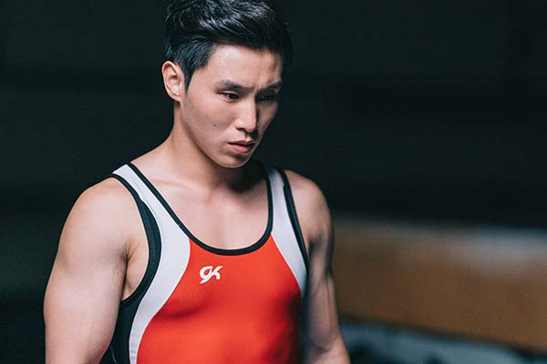

石伟雄（石仔），香港体操运动员，主项为跳马。他在2010年初次代表香港出战亚运跳马项目，并在两年后首次取得奥运的入场券，成为第一位奥运体操香港代表。

 

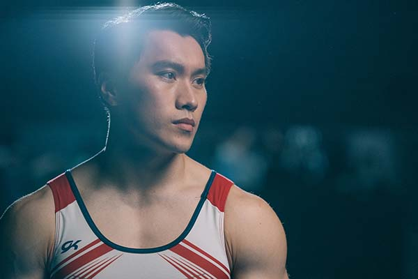

吴翘充（Kelvin），香港体操运动员，也称为「吊环王子」。在他的体操生涯中，他不仅获得多个国际奖项，更成功创造了两个以他名字命名的新吊环动作。

 

为了让石仔和Kelvin拍摄时能更容易地适应和进入状态，制作团队预先做了各种的准备工作，其中包括仔细地搜集资料，与石仔和Kelvin面谈从而进一步了解他们的日常生活习惯和日程。得知香港体操代表队目前在顺利村体育馆集训，该场地设有专业的体操训练设施，包括吊环、跳马、高低杠、鞍马、平衡木等器材，我们就立刻决定借用体育馆来作拍摄的场地，除了期望可以消除石仔和Kelvin的紧张心情，亦确保运动员可在安全的环境下完成动作拍摄，避免因拍摄的压力而不慎受伤。

 

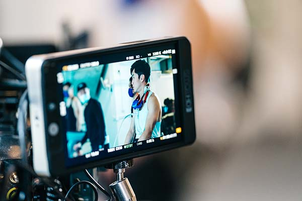

 

 

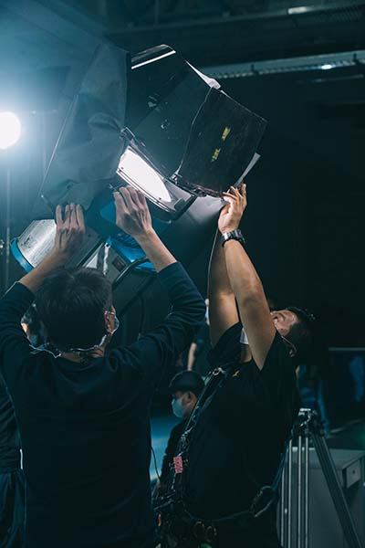

 

（制作团队认真构思每一个镜头）

 

此外，为了使画面更逼真和更有质感，石仔和Kelvin毫不马虎，拍摄时全神贯注地演绎他们的比赛动作，起跳、转身，都能感受到他们的认真、专业和扎实的功力，让我们仿佛置身在奥运比赛之中。为了将动作淋漓尽致地呈现，他们反覆演示动作，让摄影师能够采用不同角度拍摄，尽可能捕捉到细节，构造最完美的画面。

 

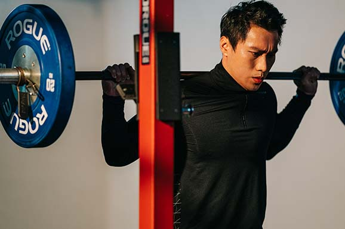

 

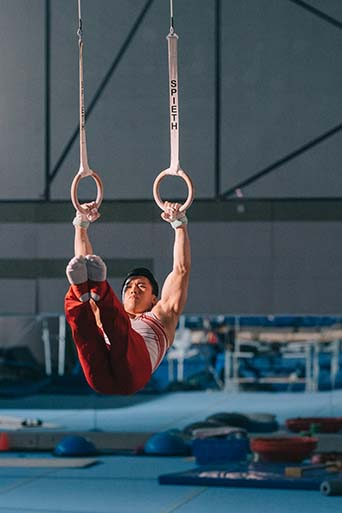

 

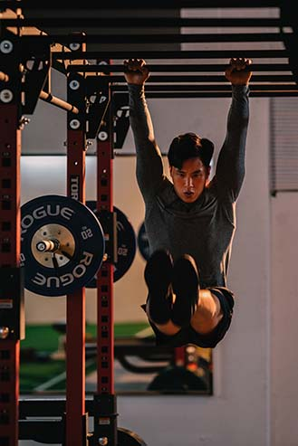

 

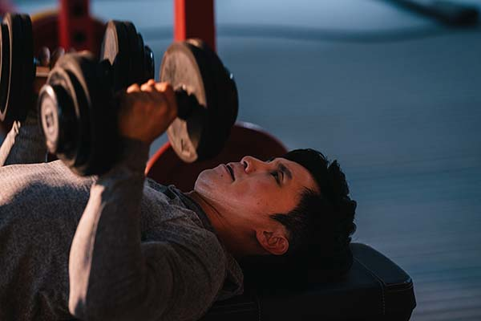

 

（石仔和Kelvin认真演示日常训练的动作）

 

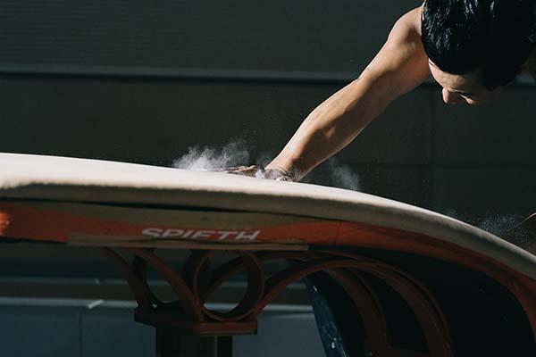

 

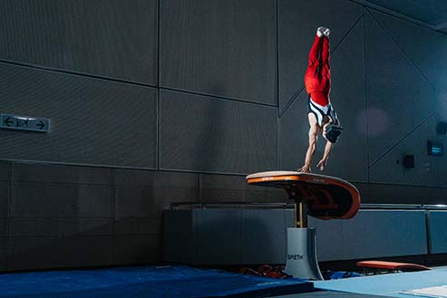

 

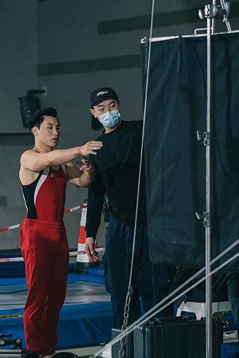

 

（力求完美，石仔反覆做出他的招牌动作）

 

### _第三位主角：Chris_

 

张立兴 (Chris)，香港自由潜水纪录保持者，也是香港自由潜水协会的会长。早前在地区赛事中，他取得了男子组的全场总冠军并同时打破了3项香港自由潜水的记录（静态闭气、动态闭气带双蹼及动态闭气不带蛙鞋）。

 

自由潜水目前在香港还并非一项普及的运动，因此制作团队在拍摄前专门请教了Chris有关他的日常训练日程。＂要不携带任何的装备，徒手潜进一个充满变数的海底世界＂，Chris坦言，＂唯一可以控制的就是他的身体和状态。＂所以他会透过每天的恒常训练，来稳定自己的身体状态，这也成了他的拍摄主要内容，在影片中可以见到不少他练习瑜伽和冥想的画面。

 

Chris解释说，练习瑜珈可以让他的身躯比一般人更柔软，有助提升他在水里的流畅度；而通过掌握腹式呼吸的技术，和冥想中专注于身体的正念技巧，能有助他心神平静，将意识带到身体的不同部位，从而能够专注于放松身心。这些训练都能让自由潜水员更有效率地运用到肌肉，减少体力的消耗，进而降低他们的耗氧量。

 

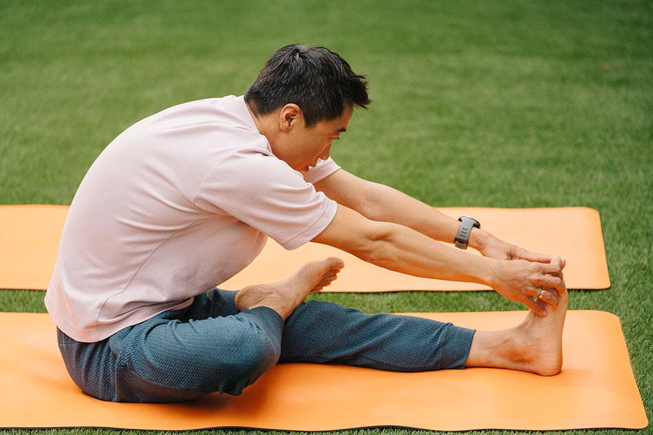

 

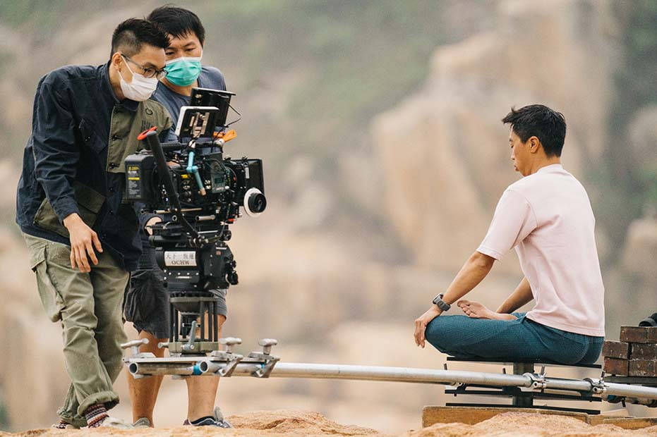

 

（拍摄内容围绕着Chris的日常瑜伽及冥想训练）

 

当然，提到自由潜水，怎么会没有户外拍摄呢？为了令拍摄更顺利，Chris在整个拍摄准备的阶段一直提供帮助。例如他比较熟识天气和海上的变化，所以也分享了很多有关天气预测的知识，帮助制作团队在准备安排工作上做得更充分，最终可以选择到合适的拍摄地点。

 

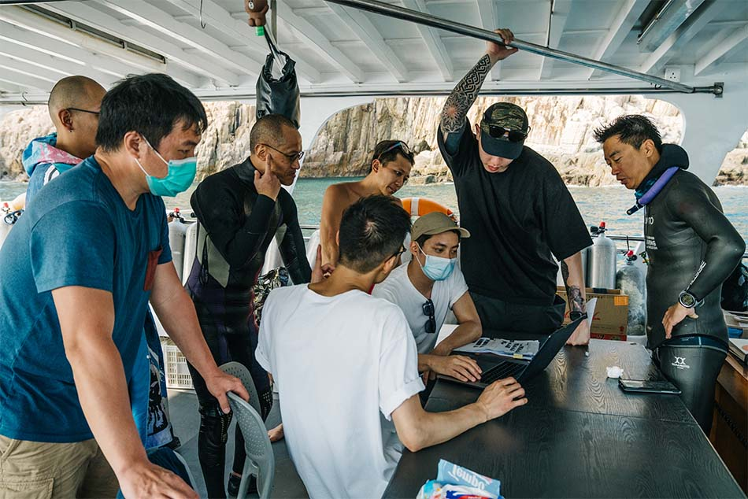

 

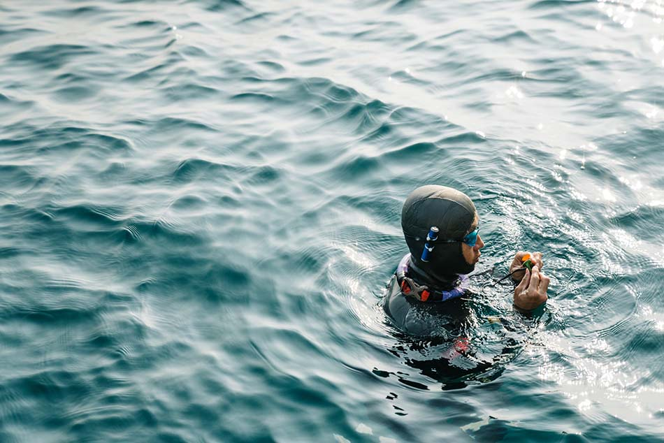

 

（Chris就像制作团队的「天文台」，提供了很多实用的天气知识）

 

备注：我们就告诉大家一个要特别留意的彩蛋吧！这次的拍摄，很高兴我们可以邀请到特别嘉宾—Chris的两位宝贝女儿。 Chris除了是自由潜水的冠军级运动员之外，他同时也是一位慈父。在拍摄现场，两位女儿熟练地做出了一字马等瑜伽动作，加上在整体的现场互动中，通过他们一家的真摰对话，可见他们的关系非常的融洽，令拍摄的气氛变得更愉快。

 

 

 

 

（Chris和两位宝贝女儿的互动，令现场气氛十分欢乐）

 

### _第四位主角：Sherie_

 

江碧蕙 (Sherie)，全球首位华人女骑师， 16岁时开始在骑术学校受训，并在一年后出道。 19岁就赢得了冠军，在往后5 年的赛马生涯中，共赢得了11 次的赛事。

 

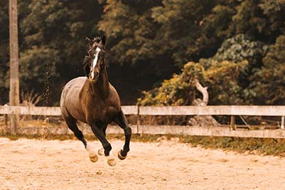

 

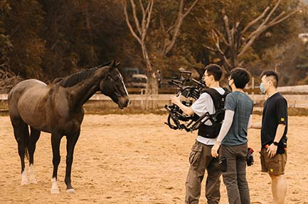

 

（制作团队尝试拍摄马儿的「动作画面」）

 

相信制作团队中没有人比Sherie 更熟悉和了解马儿的一举一动了。为了切合Sherie的拍摄内容，制作团队设定了一些她和马儿互动的画面，其中的一些画面需要Sherie做出有一定危险性的动作。为了拍摄到精彩的画面，我们需要借助Sherie的丰富经验，在短时间内透过接触马儿，来了解它当天的心情和状态。全靠Sherie事前和马儿的沟通，建立了信任与默契，我们的拍摄才得以顺利地进行。

 

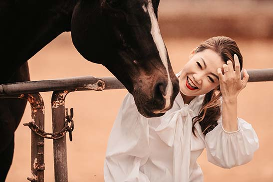

 

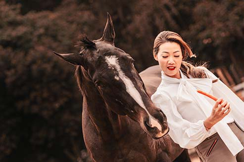

 

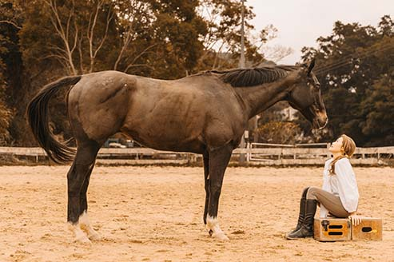

 

（全靠Sherie和马儿事先沟通，它拍摄时才乖乖听话）

 

 

## **立即看2022年的全新广告**

我们和制作团队做了周详的事前准备，全为了呈上令您目不转睛的精彩电影级画面。事不宜迟，现在立刻观看：

`youtube:https://www.youtube.com/watch?v=nSD7pEd4J-s&list=PLlChtdcugmzNg-Oa_s6cjSRVpTNH0z-6e&index=1`

（香港体操运动员 石伟雄和吴翘充的视频）

 

`youtube:https://www.youtube.com/watch?v=gIKEJ2N2MVs&list=PLlChtdcugmzNg-Oa_s6cjSRVpTNH0z-6e&index=3`

（香港自由潜水记录保持者 张立兴的视频）

 

`youtube:https://www.youtube.com/watch?v=U_3tVZWEl6I&list=PLlChtdcugmzNg-Oa_s6cjSRVpTNH0z-6e&index=2`

（全球首位华人女骑师 江碧蕙的视频）

 

 

## **「预早准备 迎接挑战无顾忌」**

当大家看见运动员站上颁奖台时，都知道这个辉煌的成就背后并不简单；一个奖牌、一个认可也是由无数的挑战、挫败和坚持累积而成，当然除此之外，最重要的还是，预早准备。

 

而对于健康管理，我们同样应该预早准备，防患于未然。以癌症为例（尤其是鼻咽癌），其实是可以提防的。鼻咽癌不像其他大部份癌症一般，年龄愈大发病率愈高，它的发病年龄相对比较早¹，既是香港20-44岁男士的头号癌症²，也是女士当中较常发病于40-60岁的癌症³。所以，任何年龄、性别，都会受到鼻咽癌的威胁。

 

此外，由于目前还没有针对性的疫苗和特效药，加上部分的早期鼻咽癌病征，例如头痛、鼻塞、耳鸣等与感冒非常相似，所以很容易被患者忽略。可幸的是，愈早发现患上鼻咽癌，愈早开展治疗，疗效愈见提升，对患者的影响也可以减到最低；数据显示，早期鼻咽癌的存活率可高于百份之九十⁴。所以，提防鼻咽癌的最佳方法，就是及早作出准备，定期进行早期鼻咽癌筛查，为自己的健康购买「保险」。

 

Take2 Prophecy™ 早期鼻咽癌筛查的准确度高于97%⁵ ⁶，而且绝少漏检；假阳性率极低 (0.7%)⁶，是市场上最准确可靠的测试。此測試採用本地頂尖大學的研發成果，並通過二萬人參與大型臨床驗証⁵，應用次世代DNA測序技術 (NGS: Next-generation Sequencing)，有效識別出早期鼻咽癌患者。

 

筛查的过程简单便捷，只需于网上完成一站式预约；不用入院，不用请假，到诊所抽血即可；一顿午饭的时间就能完成，最快三到七个工作天就有结果。

 

现在登记成为会员并使用优惠码【2022NEW】更能尊享推广优惠*！

立即预约：[https://bit.ly/37XYNpY](https://bit.ly/37XYNpY "https://bit.ly/37XYNpY")

了解更多Take2 Prophecy™ 早期鼻咽癌筛查资讯：[https://bit.ly/3MyBAK4](https://bit.ly/3MyBAK4 "https://bit.ly/3MyBAK4")

\*优惠只限首200名预约者，并受条款及细则约束。

 

 

参考资料

1\. 鼻咽癌：及早察觉、征状、放射及化学治疗. Hong Kong Anti-Cancer Society, April 2021, [https://www.hkacs.org.hk/ufiles/NasopharyngealCarcinoma.pdf](https://www.hkacs.org.hk/ufiles/NasopharyngealCarcinoma.pdf "https://www.hkacs.org.hk/ufiles/NasopharyngealCarcinoma.pdf").

2\. _Overview of Hong Kong Cancer Statistics of 2018_. Hong Kong Hospital Authority, October 2020.

3\. _Hong Kong Cancer Registry_. Hong Kong Hospital Authority, www3.ha.org.hk/cancereg/. Accessed 23 May 2021.

4\. _Overview of Hong Kong Cancer Statistics of 2019_. Hong Kong Hospital Authority, October 2021.

5\. Chan, K. C. Allen, et al. “Analysis of Plasma Epstein–Barr Virus DNA to Screen for Nasopharyngeal Cancer.” _New England Journal of Medicine_, vol. 377, no. 6, 2017, pp. 513–22.

6\. Lam, W. K. Jacky, et al. “Sequencing-Based Counting and Size Profiling of Plasma Epstein–Barr Virus DNA Enhance Population Screening of Nasopharyngeal Carcinoma.” _Proceedings of the National_ _Academy of Sciences_, vol. 115, no. 22, 2018, pp. E5115–24.