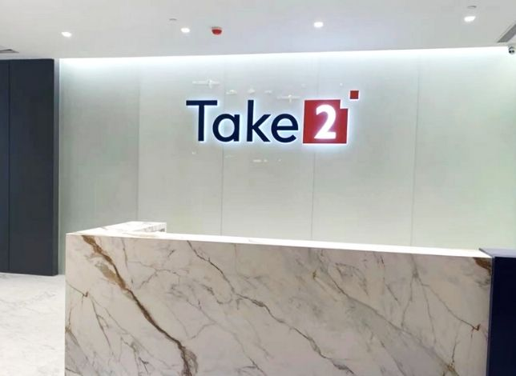

爲配合公司的長遠發展方向和滿足業務需要，Take2 Health（下稱：「得易健康」或「我司」）於2021年年底正式落戶深圳前海嘉里中心，成為我司首個香港特別行政區以外的營運基地。我司期望未來能持續將早期鼻咽癌篩查服務拓展至粵港澳大灣區，以提升灣區內人民的整體健康水平。

**深圳辦公室位處黃金地段 高規格實驗室可服務龐大人口**

得易健康深圳辦公室和實驗室位處前海黃金地段，毗鄰廣深沿江高速公路，同區聚集了高端技術型企業和人才，享盡地理優勢。我司的現代化大型醫學檢驗實驗室，按照了國家《醫學檢驗實驗室基本標準和管理規範》、ISO15189及CAP實驗室等品質管制標準來建設，其總面積超過2000多平方米（超過21,000呎），可服務灣區以至中國境內的龐大人口。

新址的設計採用了辦公室和實驗室結合的形式，有助提高內部工作效率和服務質量。此外，實驗室遵循次世代基因測序實驗室設計原則建設，並配備了穩定的供電和製冷設施，以確保實驗室的溫濕度和潔淨度；同時安裝有效的通風設施，合理設置緩衝間，實行參觀通道和實驗室專用通道分離，極大程度地降低了交叉污染的風險。

**紮根香港、服務大灣區 共同打造粵港澳抗鼻咽癌聯盟**

得易健康行政總裁 翁錦輝表示：「為配合貫徹落實國家《十四五規劃綱要》中促進產學研融合及完善廣深港科技創新走廊等相關方針，在前海管理局的指導和協助下，我們成功以嘉里中心的辦公室暨實驗室為據點，在大灣區逐步擴大服務網絡。我司以『 紮根香港、服務大灣區』為基礎，期望以準確可靠的早期鼻咽癌篩查，協助大灣區成為全國鼻咽癌早篩早診早治先行地區，強化人民早診早治意識，並與頂尖學府和醫院共同打造粵港澳抗鼻咽癌聯盟，為人民的健康謀福祉。」

得易健康的目標是成為業內的倡導者，目前本公司主力提供早期鼻咽癌篩查服務，未來有望借助大灣區的影響力，推動創新醫療研發在中國乃至整個亞洲的廣泛應用。