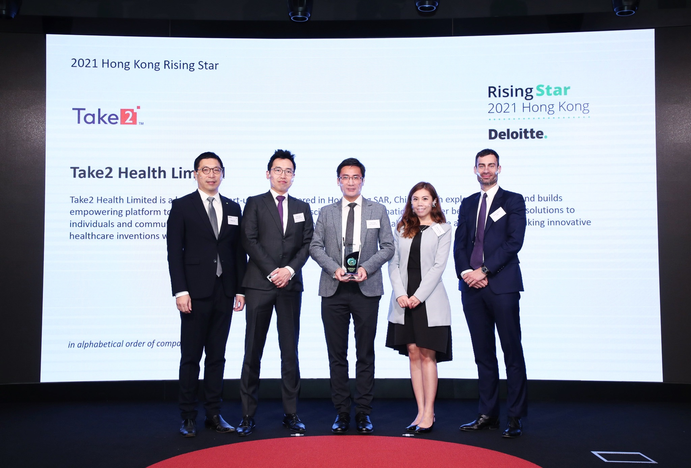
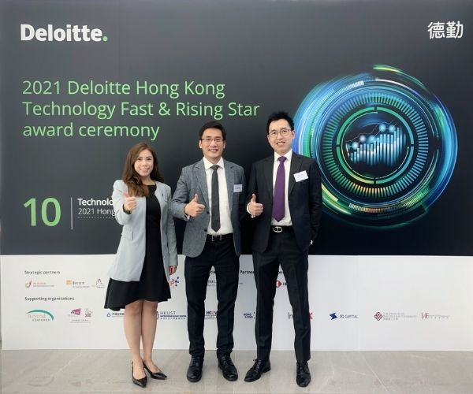

Take2 Health（下稱：我司） 於2021年12月5日參與由德勤  (Deloitte) 主辦的「香港高科技高成長及明日之星」頒獎典禮，並於同日成功獲得「2021德勤香港明日之星」這項殊榮。

「2021德勤香港明日之星」旨在發現和表彰在香港擁有領先技術、可行的商業模式和具備高增長潛力的初創企業，我司從企業願景、創始團隊、技術創新和行業前景等範疇均備受認可。我司一直堅持利用結合了PCR和次世代DNA測序 (Next-generation Sequencing) 這種頂尖技術的早期鼻咽癌篩查，為人類的健康保駕護航，去年更成功與大量本地診所及多間私營醫院建立合作關係，讓篩查服務得以惠及廣大市民。

目前，為了使大眾更容易接觸到早期鼻咽癌篩查服務，我司正致力推動市民使用專屬的網上健康服務平台，讓服務更高效、方便和快捷。在此再次感謝德勤對我司業務和發展的肯定，未來我司將持續提供更靈活和創新的健康服務予社會各界。

