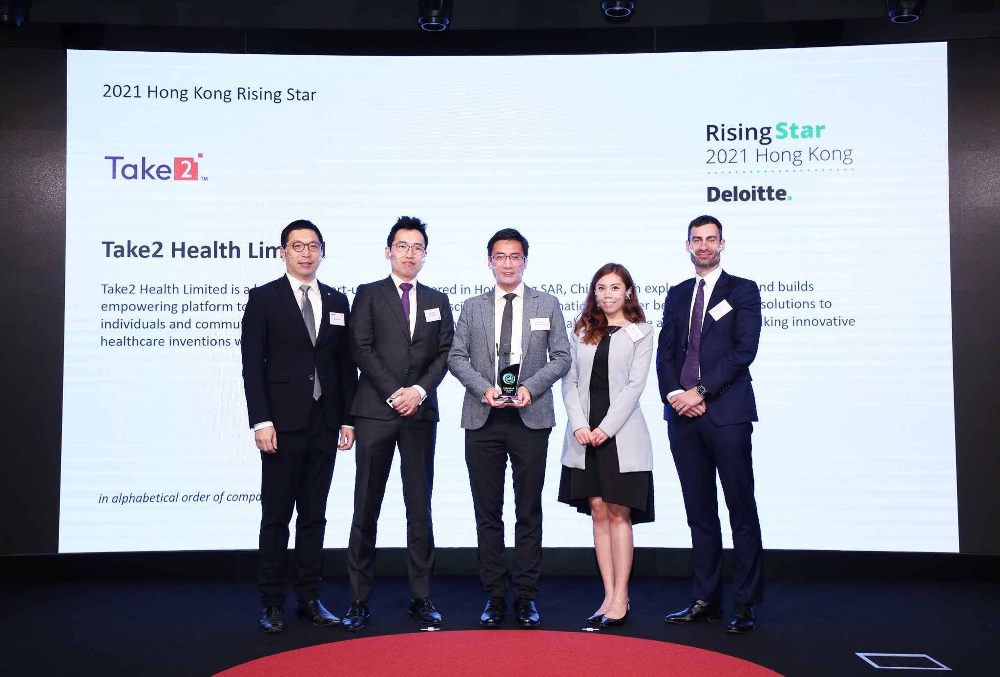
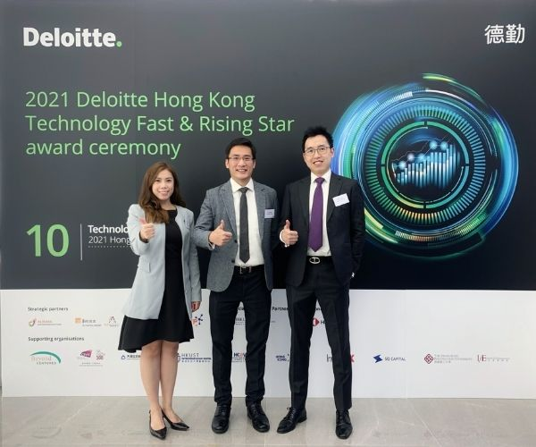

Take2 Health（下称：我司） 于2021年12月5日参与由德勤 (Deloitte) 主办的“ 香港高科技高成长及明日之星“颁奖典礼，并于同日成功获得“2021德勤香港明日之星“这项殊荣。

“2021德勤香港明日之星”旨在发现和表彰在香港拥有领先技术、可行的商业模式和具备高增长潜力的初创企业，我司从企业愿景、创始团队、技术创新和行业前景等范畴均备受认可。我司一直坚持利用结合了PCR和高通量测序 (Next-generation Sequencing) 这种顶尖技术的早期鼻咽癌筛查，为人类的健康保驾护航，去年更成功与大量本地诊所及多间私营医院建立合作关系，让筛查服务得以惠及广大市民。

目前，为了使大众更容易接触到早期鼻咽癌筛查服务，我司正致力推动市民使用专属的网上健康服务平台，让服务更高效、方便和快捷。在此再次感谢德勤对我司业务和发展的肯定，未来我司将持续提供更灵活和创新的健康服务予社会各界。

