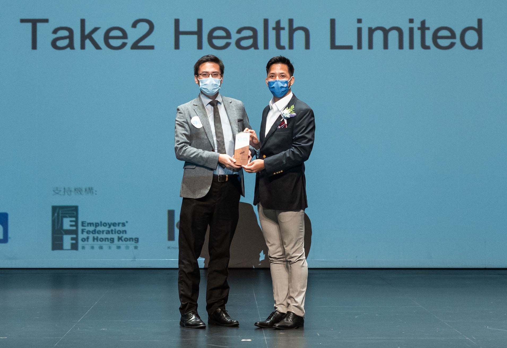
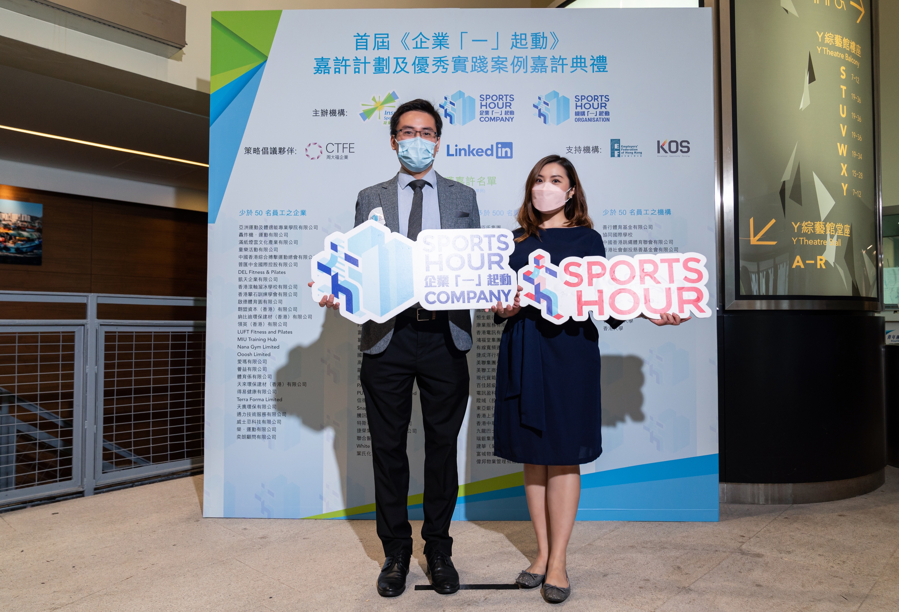
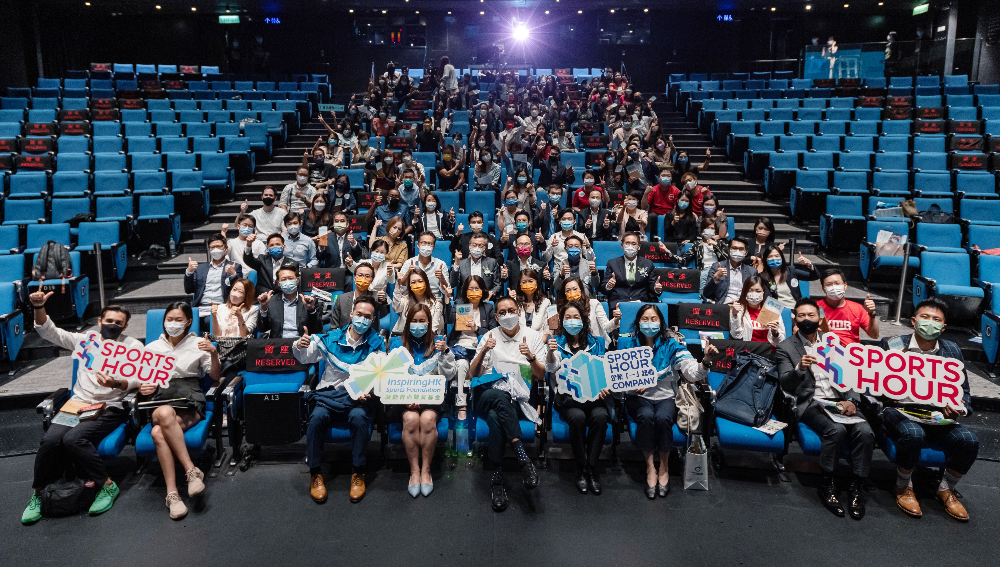

由凝動香港體育基金主辦的首屆《企業「一」起動》嘉許計劃及年度優秀實踐案例典禮於2021年9月9日假柴灣青年廣場圓滿舉行。Take2 Health（下稱：我司）獲選為受嘉許企業之一，我司對此感到十分榮幸。

此計劃旨在鼓勵香港企業和機構響應世界衛生組織的建議，帶領員工進行每天累計至少一小時的中高強度體能活動，推動員工的身心健康從而提升企業效益。讓大眾活得更健康，是我們的願景, 除了鼓勵員工及其家人多做運動外，我司還致力推動大眾關注癌症，從而提升社會的整體健康水平。

我司致力成為業界先驅，期望透過提供精準的早期癌症篩查技術，以及癌症相關資訊以宣揚健康意識，為人類長遠的健康生活帶來正面改變。

