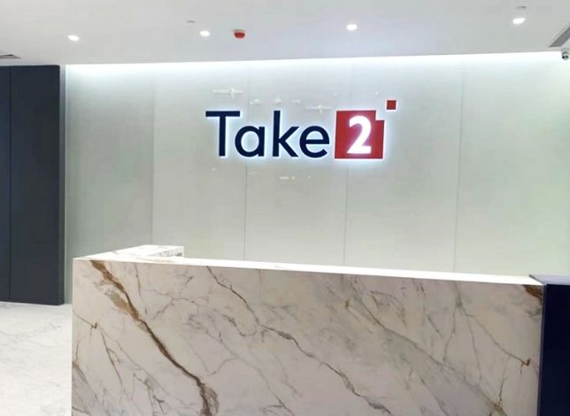

为配合公司的长远发展方向和满足业务需要，Take2 Health下称“得易健康”或“我司”）于2021年年底正式落户深圳前海嘉里中心，成为我司首个香港特别行政区以外的营运基地。我司期望未来能持续将早期鼻咽癌筛查服务拓展至粤港澳大湾区，以提升湾区内人民的整体健康水平。

**深圳办公室位处黄金地段 高规格实验室可服务庞大人口**

得易健康深圳办公室和实验室位处前海黄金地段，毗邻广深沿江高速公路，同区聚集了高端技术型企业和人才，享尽地理优势。我司的现代化大型医学检验实验室，按照了国家《医学检验实验室基本标准和管理规范》、ISO15189及CAP实验室等质量管理标准来建设，其总面积超过2000多平方米（超过21,000呎），可服务湾区以至中国境内的庞大人口。

新址的设计采用了办公室和实验室结合的形式，有助提高内部工作效率和服务质量。此外，实验室遵循高通量测序实验室设计原则建设，并配备了稳定的供电和制冷设施，以确保实验室的温湿度和洁净度；同时安装有效的通风设施，合理设置缓冲间，实行参观通道和实验室专用通道分离，极大程度地降低了交叉污染的风险。

**扎根香港、服务大湾区 共同打造粤港澳抗鼻咽癌联盟**

得易健康首席执行官翁锦辉表示：“为配合贯彻落实国家《十四五规划纲要》中促进产学研融合及完善广深港科技创新走廊等相关方针，在前海管理局的指导和协助下，我们成功以嘉里中心的办公室暨实验室为据点，在大湾区逐步扩大服务网络。我司以‘扎根香港、服务大湾区’为基础，期望以准确可靠的早期鼻咽癌筛查，协助大湾区成为全国鼻咽癌早筛早诊早治先行地区，强化人民早诊早治意识，并与顶尖学府和医院共同打造粤港澳抗鼻咽癌联盟，为人民的健康谋福祉。”~~」~~

得易健康的目标是成为业内的倡导者，目前本公司主力提供早期鼻咽癌筛查服务，未来有望借助大湾区的影响力，推动创新医疗研发在中国乃至整个亚洲的广泛应用。