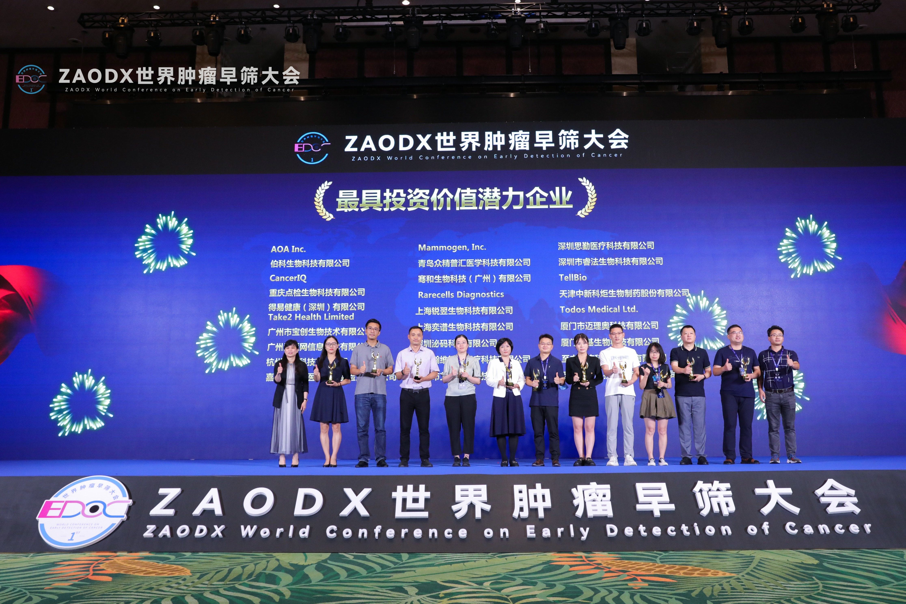
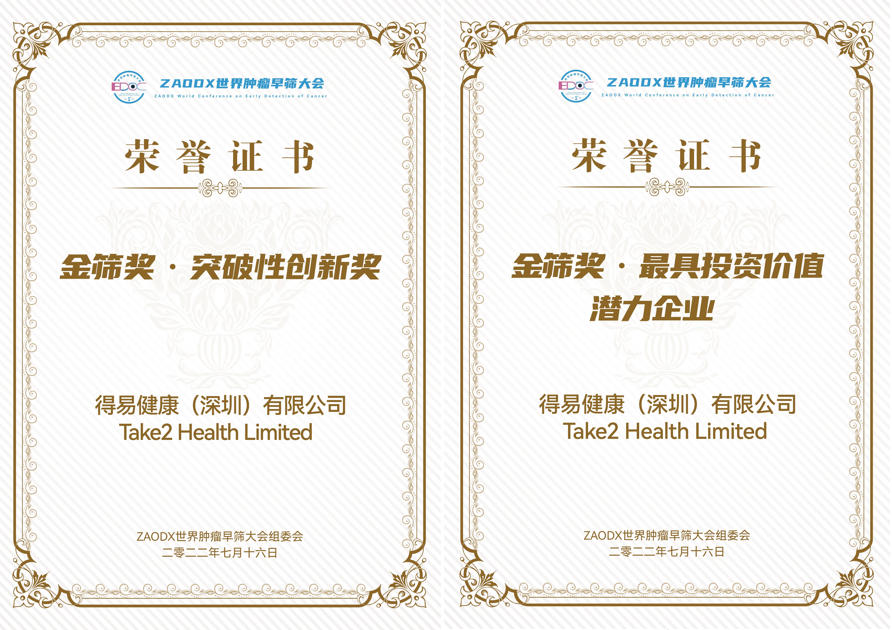
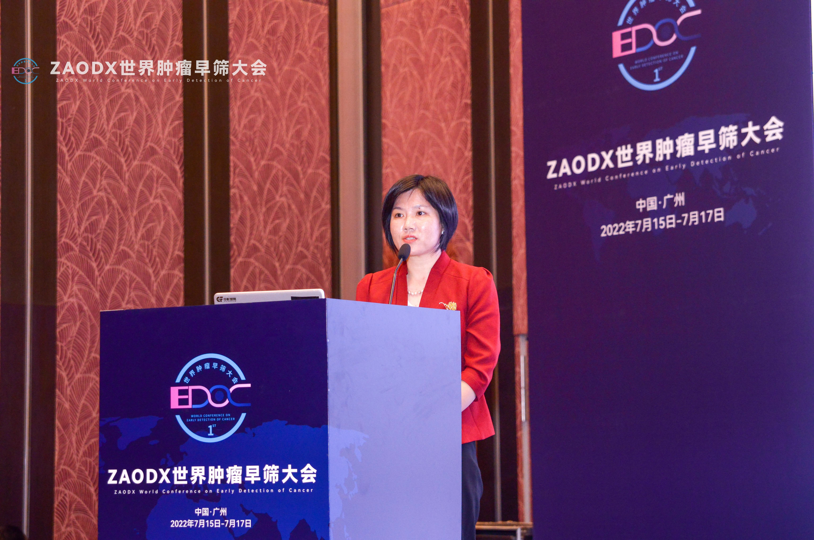
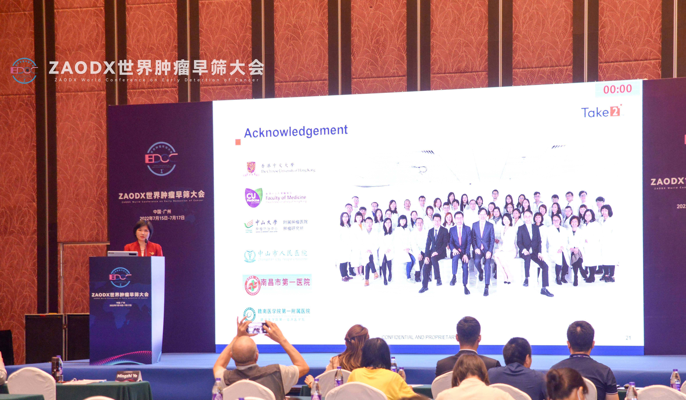

Take2 Health （下称：我司）于2022年7月15至17日参与了ZAODX世界肿瘤早筛大会，并非常荣幸能于会上获得“金筛奖‧最具投资价值潜力企业＂及“金筛奖‧突破性创新奖＂两项意义重大的殊荣。

 

ZAODX世界肿瘤早筛大会由中国国家高性能医疗器械创新中心、“一带一路＂生命科技促进联盟、海南省医学会、海南省医疗创新促进会、上海生物医学检测试剂工程技术研究中心、广州市医疗行业协会及早筛网联合主办。本次大会是首个聚焦于肿瘤早筛行业的盛会，为中国国内及全球肿瘤早筛行业从业者提供了顶级的交流平台，期望可共同倡议推进肿瘤早筛查、早诊断、早治疗，助力健康中国行动，并得到了整个行业的高度认可。

 

会上汇聚了业内资深专家、学者、研究人员、医护人员、行业协会等，我司的首席技术官叶明芝博士有幸和专家们就着肿瘤早筛议题开展了多种形式的交流和讨论外，还和他们分享了Take2 Health如何应用基因组学技术于鼻咽癌早筛上，以有效找出极早期鼻咽癌患者，提高其成功治愈的机会及存活率，并期望共同促使创新的医疗健康技术在我国乃至全世界造福广大民众。

